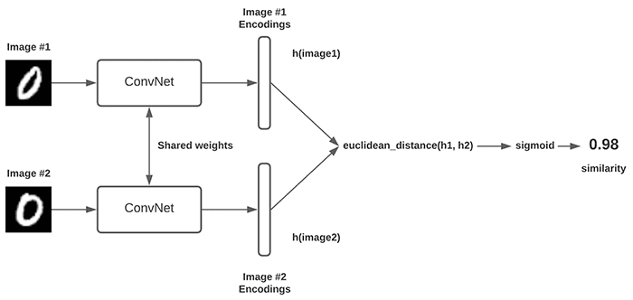
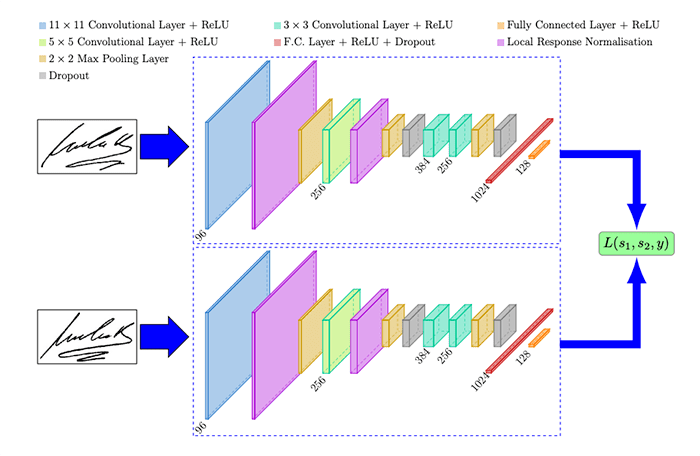
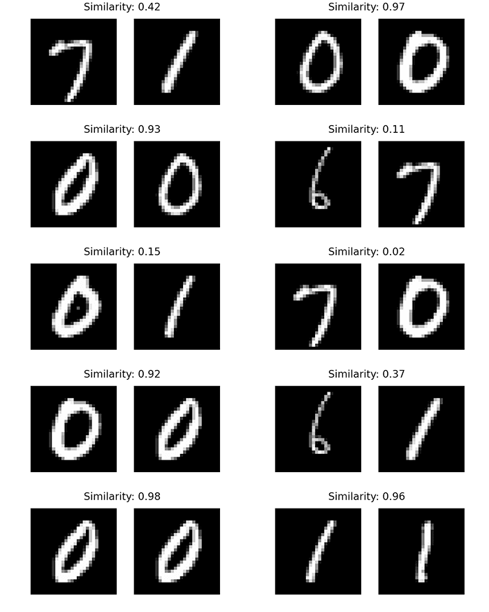
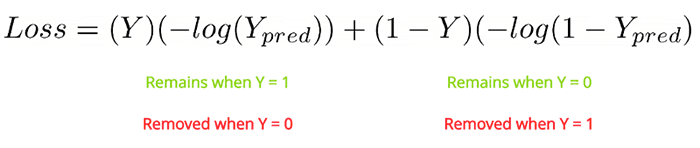

# Siamese Networks

This folder contains examples related to **Siamese Networks and Contrastive Learning** using Pytorch and Tensorflow.

Most of the examples were obtained from the [PyImageSearch](https://pyimagesearch.com/) website:

Part I: MNIST with Tensorflow / Keras

- Building Image Pairs for Siamese Networks (PyImageSearch / Tensorflow)
- Implementing Your First Siamese Network with Keras and TensorFlow (PyImageSearch / Tensorflow)
- Comparing Images for Similarity with Siamese Networks (PyImageSearch / Tensorflow)
- **Improving Accuracy with Contrastive Loss (PyImageSearch / Tensorflow)**

Part II: X

- A
- B

Part III: X

- Face Recognition with Siamese Networks, Keras, and TensorFlow (PyImageSearch / Tensorflow)
- Building a Dataset for Triplet Loss with Keras and TensorFlow (PyImageSearch / Tensorflow)
- Triplet Loss with Keras and TensorFlow (PyImageSearch / Tensorflow)
- Training and Making Predictions with Siamese Networks and Triplet Loss (PyImageSearch / Tensorflow)

Table of contents:

- [Siamese Networks](#siamese-networks)
	- [0. Set Up: Environment, GPU, etc.](#0-set-up-environment-gpu-etc)
	- [1. Introduction to Siamese Networks and Contrastive Learning](#1-introduction-to-siamese-networks-and-contrastive-learning)
	- [2. Building Image Pairs for Siamese Networks (PyImageSearch)](#2-building-image-pairs-for-siamese-networks-pyimagesearch)
	- [3. Implementing Your First Siamese Network with Keras and TensorFlow (PyImageSearch)](#3-implementing-your-first-siamese-network-with-keras-and-tensorflow-pyimagesearch)
	- [4. Comparing Images for Similarity with Siamese Networks (PyImageSearch)](#4-comparing-images-for-similarity-with-siamese-networks-pyimagesearch)
	- [5. Improving Accuracy with Contrastive Loss (PyImageSearch / Tensorflow)](#5-improving-accuracy-with-contrastive-loss-pyimagesearch--tensorflow)


## 0. Set Up: Environment, GPU, etc.

Check the GPU usage - RAM and GPU processors:
	
	Shell:
		(once)
		nvidia-smi.exe
		(everz 10 seconds)
		nvidia-smi.exe -l 10

	Notebook:
		!nvidia-smi

Basic environment installation with Pytorch:

```bash
# Crate env: requirements in conda.yaml
# This packages are the basic for Pytorch-CUDA usage
# Additionally Tensorflow/Keras is included for CPU
conda env create -f conda.yaml
conda activate siam

# Pytorch: Windows + CUDA 11.7
# Update your NVIDIA drivers: https://www.nvidia.com/Download/index.aspx
# I have version 12.1, but it works with older versions, e.g. 11.7
# Check your CUDA version with: nvidia-smi.exe
# In case of any runtime errors, check vrsion compatibility tables:
# https://github.com/pytorch/vision#installation
# The default conda installation command DID NOT WORK
# But the following pip install command DID WORK
python -m pip install torch==1.13+cu117 torchvision==0.14+cu117 torchaudio torchtext==0.14 --index-url https://download.pytorch.org/whl/cu117

# Pytorch: Mac / Windows CPU (not necessary if the previous line is executed)
python -m pip install torch torchvision torchaudio
```

Finally, dump a `requirements.txt` with all dependencies (with used versions):

```bash
# Dump installed libraries in pip format
python -m pip list --format=freeze > requirements.txt
```

The notebook [`00_GPU_Setup.ipynb`](00_GPU_Setup.ipynb) shows the GPU check necessary after installtion; I decided to allow the GPU for Pytorch, but not for Tensorflow to avoid version conflicts:

```python
import os
import torch
import torchvision

torch.__version__
# '1.13.0+cu117'

# Get info of all GPU devices
!nvidia-smi

# Set environment variable with possible device ids
os.environ["CUDA_VISIBLE_DEVICES"] = "0,1"
print(os.environ["CUDA_VISIBLE_DEVICES"])
# Set device: 0 or 1
# NOTE: indices are not necessarily the ones shown by nvidia-smi
# We need to try them with the cell below
torch.cuda.set_device("cuda:0")

# Check that the selected device is the desired one
print("Torch version?", torch.__version__)
print("Torchvision version?", torchvision.__version__)
print("Is cuda available?", torch.cuda.is_available())
print("Is cuDNN version:", torch.backends.cudnn.version())
print("cuDNN enabled? ", torch.backends.cudnn.enabled)
print("Device count?", torch.cuda.device_count())
print("Current device?", torch.cuda.current_device())
print("Device name? ", torch.cuda.get_device_name(torch.cuda.current_device()))
x = torch.rand(5, 3)
print(x)
# Torch version? 1.13.0+cu117
# Torchvision version? 0.14.0+cu117
# Is cuda available? True
# Is cuDNN version: 8500
# cuDNN enabled?  True
# Device count? 2
# Current device? 0
# Device name?  NVIDIA GeForce RTX 3060
# tensor([[0.2121, 0.7982, 0.6093],
#         [0.3610, 0.8549, 0.1980],
#         [0.4176, 0.3557, 0.2099],
#         [0.1893, 0.4797, 0.3056],
#         [0.6929, 0.5847, 0.8372]])

# Keras
import tensorflow as tf
from tensorflow.python.client import device_lib

print("Num GPUs Available: ", len(tf.config.list_physical_devices('GPU')))
device_lib.list_local_devices()
# Num GPUs Available:  0
# [name: "/device:CPU:0"
#  device_type: "CPU"
#  memory_limit: 268435456
#  locality {
#  }
#  incarnation: 7880903414775673565
#  xla_global_id: -1]
```

## 1. Introduction to Siamese Networks and Contrastive Learning

Siamese are twins merged together. In Siamese Networks, we have usually two networks in parallel and they are aranged as follows:

- Both networks have the same model/architecture.
- We feed one image to one network and another to the second network.
- The output of each network is usually a feature vector.
- The two feature vectors are compared, usually with a similarity metric, but we could use a binary cross-entropy metric, too; the similarity measurement is related to the cost function:
  - if the two images are different, the similarity should be low;
  - if both images belong to the same class, the similarity should be high.
- Instead of a pure similarity metric, we could use a distance metric together with the sigmoid activation.
- During training, weight update happends in both networks! That is, we end up having the same weights for both parallel/sister networks; in other words, both networks have shared weights.



Example network, SigNet, which is used to detect whether a signature is real or not:

[SigNet: Convolutional Siamese Network for Writer Independent Offline Signature Verification, Dey et al.](https://arxiv.org/pdf/1707.02131.pdf)

The SigNet network is the following:



As we see, we input 2 images: a reference image and a second image which we'd like to determine whether it's real or fake given the reference signature. Since the trained network is able to compute the similarity/distance of the feature vectors, we can determine the veracity of the second signature.

Some applications of Siamese Networks:

- Anti spoofing.
- Feature vector generation, so that similar images have vectors close to each other.
- Clustering (following the previous application).
- Face recognition (which happens after the face detection).

To work with Siamese Networks, we need to generated either **image pairs** or **image triplets**.

In the case of image pairs:

- We have **positive pairs**: pairs of images which belong to the same type/class: same person face, same person signature, same digit.
- We have **negative pairs**: pairs of images which belong to different type/class.

In the case of image triplets:

- There is an **anchor** image, which is the ground truth.
- A **positive image**: same class as the anchor.
- A **negative image**: different class as the anchor.

With triplets, the goal is to improve the feature vector generation so that the similarity between the anchor-positive pair is larger than between the anchor-negative pair.

We can generate positive pairs by using data augmentation for an image.

## 2. Building Image Pairs for Siamese Networks (PyImageSearch)

Links:

- Tutorial: [Building image pairs for siamese networks with Python](https://pyimagesearch.com/2020/11/23/building-image-pairs-for-siamese-networks-with-python/?_ga=2.224851610.1290695422.1688376799-1020982194.1685524223)
- [Google Colab Notebook](https://colab.research.google.com/drive/1_AZ1MoaoNzKsw7GgHi9brxlxw84GFpnV?usp=sharing)
- [Source code](https://pyimagesearch-code-downloads.s3-us-west-2.amazonaws.com/siamese-image-pairs/siamese-image-pairs.zip)
- Local/repo notebook: [`siamese_image_pairs.ipynb`](./01_siamese-image-pairs/siamese_image_pairs.ipynb)

In the notebook/code, the MNIST dataset is loaded and poistive/negative image pairs (with their label) are built and visualized.


```python
# import the necessary packages
from tensorflow.keras.datasets import mnist
from imutils import build_montages
import matplotlib.pyplot as plt
import numpy as np
import cv2

def plt_imshow(title, image):
	# convert the image frame BGR to RGB color space and display it
	plt.figure(figsize=(12, 12))
	image = cv2.cvtColor(image, cv2.COLOR_BGR2RGB)
	plt.imshow(image)
	plt.title(title)
	plt.grid(False)
	plt.show()

def make_pairs(images, labels):
	# initialize two empty lists to hold the (image, image) pairs and
	# labels to indicate if a pair is positive or negative
	pairImages = [] # [[im1, im2], [im3, im4], ...]
	pairLabels = [] # [[0], [1]] 0: negative, 1: positive

	# calculate the total number of classes present in the dataset
	# and then build a list of indexes for each class label that
	# provides the indexes for all examples with a given label
    # -> for each label/class, all image indices of that class
	numClasses = len(np.unique(labels))
	idx = [np.where(labels == i)[0] for i in range(0, numClasses)]

	# loop over all images
	for idxA in range(len(images)):
		# grab the current image and label belonging to the current
		# iteration
		currentImage = images[idxA]
		label = labels[idxA]

		# randomly pick an image that belongs to the *same* class
		# label
		idxB = np.random.choice(idx[label])
		posImage = images[idxB]

		# prepare a positive pair and update the images and labels
		# lists, respectively
		pairImages.append([currentImage, posImage])
		pairLabels.append([1])

		# grab the indices for each of the class labels *not* equal to
		# the current label and randomly pick an image corresponding
		# to a label *not* equal to the current label
		negIdx = np.where(labels != label)[0]
		negImage = images[np.random.choice(negIdx)]

		# prepare a negative pair of images and update our lists
		pairImages.append([currentImage, negImage])
		pairLabels.append([0])

	# return a 2-tuple of our image pairs and labels
	return (np.array(pairImages), np.array(pairLabels))

# load MNIST dataset and scale the pixel values to the range of [0, 1]
print("[INFO] loading MNIST dataset...")
(trainX, trainY), (testX, testY) = mnist.load_data()

# build the positive and negative image pairs
print("[INFO] preparing positive and negative pairs...")
(pairTrain, labelTrain) = make_pairs(trainX, trainY)
(pairTest, labelTest) = make_pairs(testX, testY)

# initialize the list of images that will be used when building our
# montage
images = []

# loop over a sample of our training pairs
for i in np.random.choice(np.arange(0, len(pairTrain)), size=(49,)):
	# grab the current image pair and label
	imageA = pairTrain[i][0]
	imageB = pairTrain[i][1]
	label = labelTrain[i]

	# to make it easier to visualize the pairs and their positive or
	# negative annotations, we're going to "pad" the pair with four
	# pixels along the top, bottom, and right borders, respectively
	output = np.zeros((36, 60), dtype="uint8")
	pair = np.hstack([imageA, imageB])
	output[4:32, 0:56] = pair

	# set the text label for the pair along with what color we are
	# going to draw the pair in (green for a "positive" pair and
	# red for a "negative" pair)
	text = "neg" if label[0] == 0 else "pos"
	color = (0, 0, 255) if label[0] == 0 else (0, 255, 0)

	# create a 3-channel RGB image from the grayscale pair, resize
	# it from 28x28 to 96x51 (so we can better see it), and then
	# draw what type of pair it is on the image
	vis = cv2.merge([output] * 3)
	vis = cv2.resize(vis, (96, 51), interpolation=cv2.INTER_LINEAR)
	cv2.putText(vis, text, (2, 12), cv2.FONT_HERSHEY_SIMPLEX, 0.75,
		color, 2)

	# add the pair visualization to our list of output images
	images.append(vis)

# construct the montage for the images
montage = build_montages(images, (96, 51), (7, 7))[0]

# show the output montage
plt_imshow("Siamese Image Pairs", montage)
```

## 3. Implementing Your First Siamese Network with Keras and TensorFlow (PyImageSearch)

Links:

- Tutorial: [Siamese networks with Keras, TensorFlow, and Deep Learning](https://pyimagesearch.com/2020/11/30/siamese-networks-with-keras-tensorflow-and-deep-learning/?_ga=2.190651691.1290695422.1688376799-1020982194.1685524223)
- [Google Colab Notebook](https://colab.research.google.com/drive/143_LIaI-wWVQIgw93gQVU9NCcgWBRFNZ?usp=sharing)
- [Source code](https://pyimagesearch-code-downloads.s3-us-west-2.amazonaws.com/keras-siamese-networks/keras-siamese-networks.zip)
- Local/repo notebook: [`keras_siamese_networks.ipynb`](./02_keras-siamese-networks/keras_siamese_networks.ipynb)

In this project a Siamese Network is defined and trained using Tensorflow/Keras. The used dataset is MNIST.
The trained model (weights) is saved to disk. Summary of steps:

- Config dictionary
- Image pairs are created
- Euclidean distance function: we need to define it as a Keras object so that it's a layer.
- Siamese network is built:
  - No Sequential API is used, but the Functional API
  - `Lambda(euclidean_distance)` for the feature vectors of the images
  - The comparison after the `Lambda` is passed to a `Dense(1)` with the `sigmoid` activation
  - The output of the sigmoid is evaluated in a binary cross-entropy loss function; usually, more sophisticated or specific loss functions are used, but for a simple example as the MNIST case, it's fine to use binary cross-entropy.

```python
# import the necessary packages
from tensorflow.keras.models import Model
from tensorflow.keras.layers import Input
from tensorflow.keras.layers import Lambda
from tensorflow.keras.layers import Conv2D
from tensorflow.keras.layers import Dense
from tensorflow.keras.layers import Dropout
from tensorflow.keras.layers import GlobalAveragePooling2D
from tensorflow.keras.layers import MaxPooling2D
from tensorflow.keras.datasets import mnist
import tensorflow.keras.backend as K
import matplotlib.pyplot as plt
import numpy as np
import os


class Config:
    # specify the shape of the inputs for our network
    # in our case, we'll use MNIST, so it's 28x28
    IMG_SHAPE = (28, 28, 1)

    # specify the batch size and number of epochs
    BATCH_SIZE = 64
    # Siamese Networks require 100s of epochs
    EPOCHS = 20 # 100

    # define the path to the base output directory
    BASE_OUTPUT = "output"

    # use the base output path to derive the path to the serialized
    # model along with training history plot
    MODEL_PATH = os.path.sep.join([BASE_OUTPUT, "siamese_model"])
    PLOT_PATH = os.path.sep.join([BASE_OUTPUT, "plot.png"])

# instantiate the config class
config = Config()


def make_pairs(images, labels):
	# initialize two empty lists to hold the (image, image) pairs and
	# labels to indicate if a pair is positive or negative
	pairImages = []
	pairLabels = []

	# calculate the total number of classes present in the dataset
	# and then build a list of indexes for each class label that
	# provides the indexes for all examples with a given label
	numClasses = len(np.unique(labels))
	idx = [np.where(labels == i)[0] for i in range(0, numClasses)]

	# loop over all images
	for idxA in range(len(images)):
		# grab the current image and label belonging to the current
		# iteration
		currentImage = images[idxA]
		label = labels[idxA]

		# randomly pick an image that belongs to the *same* class
		# label
		idxB = np.random.choice(idx[label])
		posImage = images[idxB]

		# prepare a positive pair and update the images and labels
		# lists, respectively
		pairImages.append([currentImage, posImage])
		pairLabels.append([1])

		# grab the indices for each of the class labels *not* equal to
		# the current label and randomly pick an image corresponding
		# to a label *not* equal to the current label
		negIdx = np.where(labels != label)[0]
		negImage = images[np.random.choice(negIdx)]

		# prepare a negative pair of images and update our lists
		pairImages.append([currentImage, negImage])
		pairLabels.append([0])

	# return a 2-tuple of our image pairs and labels
	return (np.array(pairImages), np.array(pairLabels))


def euclidean_distance(vectors):
	# unpack the vectors into separate lists
	(featsA, featsB) = vectors

	# compute the sum of squared distances between the vectors
	sumSquared = K.sum(K.square(featsA - featsB), axis=1,
		keepdims=True)

	# return the euclidean distance between the vectors
	return K.sqrt(K.maximum(sumSquared, K.epsilon()))


def plot_training(H, plotPath):
	# construct a plot that plots and saves the training history
	plt.style.use("ggplot")
	plt.figure()
	plt.plot(H.history["loss"], label="train_loss")
	plt.plot(H.history["val_loss"], label="val_loss")
	plt.plot(H.history["accuracy"], label="train_acc")
	plt.plot(H.history["val_accuracy"], label="val_acc")
	plt.title("Training Loss and Accuracy")
	plt.xlabel("Epoch #")
	plt.ylabel("Loss/Accuracy")
	plt.legend(loc="lower left")
	plt.savefig(plotPath)


def build_siamese_model(inputShape, embeddingDim=48):
    # Although we have two sister networks,
    # we only need to define one network.
    # Usually, we'll require a more complex network,
    # but since we're working with MNIST, we define
    # this simple architecture:
    # (Conv2D, MaxPool, Dropout) x 2
    # Additionally, the feature vector dimension,
    # embeddingDim = 48
    
	# specify the inputs for the feature extractor network
	inputs = Input(inputShape)

	# define the first set of CONV => RELU => POOL => DROPOUT layers
	x = Conv2D(64, (2, 2), padding="same", activation="relu")(inputs)
	x = MaxPooling2D(pool_size=(2, 2))(x)
	x = Dropout(0.3)(x)

	# second set of CONV => RELU => POOL => DROPOUT layers
	x = Conv2D(64, (2, 2), padding="same", activation="relu")(x)
	x = MaxPooling2D(pool_size=2)(x)
	x = Dropout(0.3)(x)

	# prepare the final outputs
	pooledOutput = GlobalAveragePooling2D()(x)
	outputs = Dense(embeddingDim)(pooledOutput)

	# build the model
	model = Model(inputs, outputs)

	# return the model to the calling function
	return model


# load MNIST dataset and scale the pixel values to the range of [0, 1]
print("[INFO] loading MNIST dataset...")
(trainX, trainY), (testX, testY) = mnist.load_data()
trainX = trainX / 255.0
testX = testX / 255.0

# add a channel dimension to the images
trainX = np.expand_dims(trainX, axis=-1)
testX = np.expand_dims(testX, axis=-1)

# prepare the positive and negative pairs
print("[INFO] preparing positive and negative pairs...")
(pairTrain, labelTrain) = make_pairs(trainX, trainY)
(pairTest, labelTest) = make_pairs(testX, testY)

# configure the siamese network
print("[INFO] building siamese network...")
imgA = Input(shape=config.IMG_SHAPE)
imgB = Input(shape=config.IMG_SHAPE)
# Now, the next 6 lines are key: although we have 2 sister networks
# we instantiate only one network!
# We should understand the network as a feature extractor to which we pass 2 images.
# The the extracted feature vectors are concatenated
# and passed to the similarity/distance computation layer/function.
# 
featureExtractor = build_siamese_model(config.IMG_SHAPE)
featsA = featureExtractor(imgA)
featsB = featureExtractor(imgB)

# finally, construct the siamese network
distance = Lambda(euclidean_distance)([featsA, featsB])
outputs = Dense(1, activation="sigmoid")(distance)
model = Model(inputs=[imgA, imgB], outputs=outputs)

featureExtractor.summary()
model.summary()

# compile the model
print("[INFO] compiling model...")
model.compile(loss="binary_crossentropy", optimizer="adam",
	metrics=["accuracy"])

# train the model
print("[INFO] training model...")
history = model.fit(
	[pairTrain[:, 0], pairTrain[:, 1]], labelTrain[:],
	validation_data=([pairTest[:, 0], pairTest[:, 1]], labelTest[:]),
	batch_size=config.BATCH_SIZE,
	epochs=config.EPOCHS)

# serialize the model to disk
print("[INFO] saving siamese model...")
model.save(config.MODEL_PATH)

# plot the training history
print("[INFO] plotting training history...")
plot_training(history, config.PLOT_PATH)
```

## 4. Comparing Images for Similarity with Siamese Networks (PyImageSearch)

Links:

- Tutorial: [Comparing images for similarity using siamese networks, Keras, and TensorFlow](https://pyimagesearch.com/2020/12/07/comparing-images-for-similarity-using-siamese-networks-keras-and-tensorflow/?_ga=2.36060704.1290695422.1688376799-1020982194.1685524223)
- [Google Colab Notebook](https://colab.research.google.com/drive/1FLZQmEoQdf7r6c_YoYEYZVAeClwVg149?usp=sharing)
- [Source code](https://pyimagesearch-code-downloads.s3-us-west-2.amazonaws.com/compare-images-siamese-networks/compare-images-siamese-networks.zip)
- Local/repo notebook: [`compare_images_siamese_networks.ipynb`](./03_compare-images-siamese-networks/compare_images_siamese_networks.ipynb)

In thi sproject, images from the MNIST dataset are loaded in random pairs and fed to the trained Siamese Network to predict their similarity.



```python
# import the necessary packages
from pyimagesearch import config
from tensorflow.keras.models import load_model
from imutils.paths import list_images
import matplotlib.pyplot as plt
import numpy as np
import argparse
import cv2

# # construct the argument parser and parse the arguments
# ap = argparse.ArgumentParser()
# ap.add_argument("-i", "--input", required=True,
# 	help="path to input directory of testing images")
# args = vars(ap.parse_args())

# since we are using Jupyter Notebooks we can replace our argument
# parsing code with *hard coded* arguments and values
args = {
	"input": "examples"
}

# grab the test dataset image paths and then randomly generate a
# total of 10 image pairs
print("[INFO] loading test dataset...")
testImagePaths = list(list_images(args["input"]))
np.random.seed(42)
pairs = np.random.choice(testImagePaths, size=(10, 2))

# load the model from disk
print("[INFO] loading siamese model...")
model = load_model(config.MODEL_PATH)

# loop over all image pairs
for (i, (pathA, pathB)) in enumerate(pairs):
	# load both the images and convert them to grayscale
	imageA = cv2.imread(pathA, 0)
	imageB = cv2.imread(pathB, 0)

	# create a copy of both the images for visualization purpose
	origA = imageA.copy()
	origB = imageB.copy()

	# add channel a dimension to both the images
	imageA = np.expand_dims(imageA, axis=-1)
	imageB = np.expand_dims(imageB, axis=-1)

	# add a batch dimension to both images
	imageA = np.expand_dims(imageA, axis=0)
	imageB = np.expand_dims(imageB, axis=0)

	# scale the pixel values to the range of [0, 1]
	imageA = imageA / 255.0
	imageB = imageB / 255.0

	# use our siamese model to make predictions on the image pair,
	# indicating whether or not the images belong to the same class
	preds = model.predict([imageA, imageB])
	proba = preds[0][0]

	# initialize the figure
	fig = plt.figure("Pair #{}".format(i + 1), figsize=(4, 2))
	plt.suptitle("Similarity: {:.2f}".format(proba))

	# show first image
	ax = fig.add_subplot(1, 2, 1)
	plt.imshow(origA, cmap=plt.cm.gray)
	plt.axis("off")

	# show the second image
	ax = fig.add_subplot(1, 2, 2)
	plt.imshow(origB, cmap=plt.cm.gray)
	plt.axis("off")

	# show the plot
	plt.show()
```

## 5. Improving Accuracy with Contrastive Loss (PyImageSearch / Tensorflow)

Links:

- Tutorial: [Contrastive Loss for Siamese Networks with Keras and TensorFlow](https://pyimagesearch.com/2021/01/18/contrastive-loss-for-siamese-networks-with-keras-and-tensorflow/?_ga=2.36180640.1290695422.1688376799-1020982194.1685524223)
- [Google Colab Notebook](https://colab.research.google.com/drive/10zpbE6cMEEzws-fkR_88Cb_X5OsMD1Za?usp=sharing)
- [Source code](https://pyimagesearch-code-downloads.s3-us-west-2.amazonaws.com/contrastive-loss-keras/contrastive-loss-keras.zip)
- Local/repo notebook: [`contrastive_loss_keras.ipynb`](./04_contrastive-loss-keras/contrastive_loss_keras.ipynb)

This is a **summary tutorial which contains all the previous 3 examples**; additionally, the **contrastive loss** function is implemented, which improves the binary cross entropy loss. In reality, the formula of the contrastive loss is ver similar to the binary cross-entropy:

- Both positive and negative image pairs are considered.
- The distance `D` or `D_w` is sumtiplied to each term, to scale it with the Euclidean distance between the vectors.
- We also use a `margin` hyperparameter, which adds an offset to the distance; it is often set to be 1, but we might need to tune it.
- There is no sigmoid now: the model output is the Euclidean distance itself.




Contrastive loss is usually more robust than binary cross-entropy. Since we have no sigmoid in the output, we need to figure out a threshold to determine whether two images belog to the same class. We can evaluate that threshold experimentally by observing the distribution of the positive and negative pairs, i.e., the distribution of their Euclidean distances. Something similar is done with anomaly detection.

```python
# import the necessary packages
from tensorflow.keras.models import Model
from tensorflow.keras.layers import Input
from tensorflow.keras.layers import Conv2D
from tensorflow.keras.layers import Dense
from tensorflow.keras.layers import Dropout
from tensorflow.keras.layers import GlobalAveragePooling2D
from tensorflow.keras.layers import MaxPooling2D
from tensorflow.keras.models import Model
from tensorflow.keras.layers import Dense
from tensorflow.keras.layers import Input
from tensorflow.keras.layers import Lambda
from tensorflow.keras.datasets import mnist
from tensorflow.keras.models import load_model
from imutils.paths import list_images
import tensorflow.keras.backend as K
import matplotlib.pyplot as plt
import tensorflow as tf
import numpy as np
import cv2
import os

class config:
    # specify the shape of the inputs for our network
    IMG_SHAPE = (28, 28, 1)

    # specify the batch size and number of epochs
    BATCH_SIZE = 64

    # Usually, we need 100s of epochs
    # with Siamese Networks
    EPOCHS = 5 #100

    # define the path to the base output directory
    BASE_OUTPUT = "output"

    # use the base output path to derive the path to the serialized
    # model along with training history plot
    MODEL_PATH = os.path.sep.join([BASE_OUTPUT,
        "contrastive_siamese_model"])
    PLOT_PATH = os.path.sep.join([BASE_OUTPUT,
        "contrastive_plot.png"])

def make_pairs(images, labels):
	# initialize two empty lists to hold the (image, image) pairs and
	# labels to indicate if a pair is positive or negative
	pairImages = []
	pairLabels = []

	# calculate the total number of classes present in the dataset
	# and then build a list of indexes for each class label that
	# provides the indexes for all examples with a given label
	numClasses = len(np.unique(labels))
	idx = [np.where(labels == i)[0] for i in range(0, numClasses)]

	# loop over all images
	for idxA in range(len(images)):
		# grab the current image and label belonging to the current
		# iteration
		currentImage = images[idxA]
		label = labels[idxA]

		# randomly pick an image that belongs to the *same* class
		# label
		idxB = np.random.choice(idx[label])
		posImage = images[idxB]

		# prepare a positive pair and update the images and labels
		# lists, respectively
		pairImages.append([currentImage, posImage])
		pairLabels.append([1])

		# grab the indices for each of the class labels *not* equal to
		# the current label and randomly pick an image corresponding
		# to a label *not* equal to the current label
		negIdx = np.where(labels != label)[0]
		negImage = images[np.random.choice(negIdx)]

		# prepare a negative pair of images and update our lists
		pairImages.append([currentImage, negImage])
		pairLabels.append([0])

	# return a 2-tuple of our image pairs and labels
	return (np.array(pairImages), np.array(pairLabels))


def euclidean_distance(vectors):
	# unpack the vectors into separate lists
	(featsA, featsB) = vectors

	# compute the sum of squared distances between the vectors
	sumSquared = K.sum(K.square(featsA - featsB), axis=1,
		keepdims=True)

	# return the euclidean distance between the vectors
	return K.sqrt(K.maximum(sumSquared, K.epsilon()))


def plot_training(H, plotPath):
	# construct a plot that plots and saves the training history
	plt.style.use("ggplot")
	plt.figure()
	plt.plot(H.history["loss"], label="train_loss")
	plt.plot(H.history["val_loss"], label="val_loss")
	plt.title("Training Loss")
	plt.xlabel("Epoch #")
	plt.ylabel("Loss")
	plt.legend(loc="lower left")
	plt.savefig(plotPath)


def build_siamese_model(inputShape, embeddingDim=48):
	# specify the inputs for the feature extractor network
	inputs = Input(inputShape)

	# define the first set of CONV => RELU => POOL => DROPOUT layers
	x = Conv2D(64, (2, 2), padding="same", activation="relu")(inputs)
	x = MaxPooling2D(pool_size=(2, 2))(x)
	x = Dropout(0.3)(x)

	# second set of CONV => RELU => POOL => DROPOUT layers
	x = Conv2D(64, (2, 2), padding="same", activation="relu")(x)
	x = MaxPooling2D(pool_size=2)(x)
	x = Dropout(0.3)(x)

	# prepare the final outputs
	pooledOutput = GlobalAveragePooling2D()(x)
	outputs = Dense(embeddingDim)(pooledOutput)

	# build the model
	model = Model(inputs, outputs)

	# return the model to the calling function
	return model


def contrastive_loss(y, preds, margin=1):
	# explicitly cast the true class label data type to the predicted
	# class label data type (otherwise we run the risk of having two
	# separate data types, causing TensorFlow to error out)
	y = tf.cast(y, preds.dtype)

	# calculate the contrastive loss between the true labels and
	# the predicted labels
	squaredPreds = K.square(preds)
	squaredMargin = K.square(K.maximum(margin - preds, 0))
	loss = K.mean(y * squaredPreds + (1 - y) * squaredMargin)

	# return the computed contrastive loss to the calling function
	return loss


# load MNIST dataset and scale the pixel values to the range of [0, 1]
print("[INFO] loading MNIST dataset...")
(trainX, trainY), (testX, testY) = mnist.load_data()
trainX = trainX / 255.0
testX = testX / 255.0

# add a channel dimension to the images
trainX = np.expand_dims(trainX, axis=-1)
testX = np.expand_dims(testX, axis=-1)

# prepare the positive and negative pairs
print("[INFO] preparing positive and negative pairs...")
(pairTrain, labelTrain) = make_pairs(trainX, trainY)
(pairTest, labelTest) = make_pairs(testX, testY)


# configure the siamese network
print("[INFO] building siamese network...")
imgA = Input(shape=config.IMG_SHAPE)
imgB = Input(shape=config.IMG_SHAPE)
featureExtractor = build_siamese_model(config.IMG_SHAPE)
featsA = featureExtractor(imgA)
featsB = featureExtractor(imgB)

# finally, construct the siamese network
distance = Lambda(euclidean_distance)([featsA, featsB])
model = Model(inputs=[imgA, imgB], outputs=distance)


# compile the model
print("[INFO] compiling model...")
model.compile(loss=contrastive_loss, optimizer="adam")

# train the model
print("[INFO] training model...")
history = model.fit(
	[pairTrain[:, 0], pairTrain[:, 1]], labelTrain[:],
	validation_data=([pairTest[:, 0], pairTest[:, 1]], labelTest[:]),
	batch_size=config.BATCH_SIZE,
	epochs=config.EPOCHS)

# serialize the model to disk
print("[INFO] saving siamese model...")
model.save(config.MODEL_PATH)

# plot the training history
print("[INFO] plotting training history...")
plot_training(history, config.PLOT_PATH)


# # construct the argument parser and parse the arguments
# ap = argparse.ArgumentParser()
# ap.add_argument("-i", "--input", required=True,
# 	help="path to input directory of testing images")
# args = vars(ap.parse_args())

# since we are using Jupyter Notebooks we can replace our argument
# parsing code with *hard coded* arguments and values
args = {
    "input": "examples"
}

# grab the test dataset image paths and then randomly generate a
# total of 10 image pairs
print("[INFO] loading test dataset...")
testImagePaths = list(list_images(args["input"]))
np.random.seed(42)
pairs = np.random.choice(testImagePaths, size=(10, 2))

# load the model from disk
print("[INFO] loading siamese model...")
model = load_model(config.MODEL_PATH, compile=False)

# loop over all image pairs
for (i, (pathA, pathB)) in enumerate(pairs):
	# load both the images and convert them to grayscale
	imageA = cv2.imread(pathA, 0)
	imageB = cv2.imread(pathB, 0)

	# create a copy of both the images for visualization purpose
	origA = imageA.copy()
	origB = imageB.copy()

	# add channel a dimension to both the images
	imageA = np.expand_dims(imageA, axis=-1)
	imageB = np.expand_dims(imageB, axis=-1)

	# add a batch dimension to both images
	imageA = np.expand_dims(imageA, axis=0)
	imageB = np.expand_dims(imageB, axis=0)

	# scale the pixel values to the range of [0, 1]
	imageA = imageA / 255.0
	imageB = imageB / 255.0

	# use our siamese model to make predictions on the image pair,
	# indicating whether or not the images belong to the same class
	preds = model.predict([imageA, imageB])
	proba = preds[0][0]

	# initialize the figure
	fig = plt.figure("Pair #{}".format(i + 1), figsize=(4, 2))
	plt.suptitle("Distance: {:.2f}".format(proba))

	# show first image
	ax = fig.add_subplot(1, 2, 1)
	plt.imshow(origA, cmap=plt.cm.gray)
	plt.axis("off")

	# show the second image
	ax = fig.add_subplot(1, 2, 2)
	plt.imshow(origB, cmap=plt.cm.gray)
	plt.axis("off")

	# show the plot
	plt.show()

```
