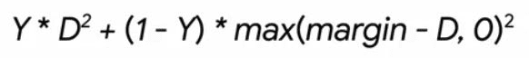

# Siamese Networks

This folder contains examples related to **Siamese Networks and Contrastive Learning** using Pytorch and Tensorflow.

Most of the examples were obtained from the [PyImageSearch](https://pyimagesearch.com/) website:

Part I: MNIST with Tensorflow / Keras (PyImageSearch)

- Building Image Pairs for Siamese Networks (PyImageSearch / Tensorflow)
- Implementing Your First Siamese Network with Keras and TensorFlow (PyImageSearch / Tensorflow)
- Comparing Images for Similarity with Siamese Networks (PyImageSearch / Tensorflow)
- Summary and compilation: **Improving Accuracy with Contrastive Loss (PyImageSearch / Tensorflow)**

Part II: Face Recognition with Tensorflow / Keras (PyImageSearch)

- Face Recognition with Siamese Networks, Keras, and TensorFlow (PyImageSearch / Tensorflow)
- Building a Dataset for Triplet Loss with Keras and TensorFlow (PyImageSearch / Tensorflow)
- Triplet Loss with Keras and TensorFlow (PyImageSearch / Tensorflow)
- Summary and compilation: **Training and Making Predictions with Siamese Networks and Triplet Loss (PyImageSearch / Tensorflow)**

However, some topics are not from [PyImageSearch](https://pyimagesearch.com/):

- MNIST with Pytorch
- CIFAR with Pytorch
- SigNet with Pytorch
- Face Recognition Pytorch

Table of contents:

- [Siamese Networks](#siamese-networks)
	- [0. Set Up: Environment, GPU, etc.](#0-set-up-environment-gpu-etc)
	- [1. Introduction to Siamese Networks and Contrastive Learning](#1-introduction-to-siamese-networks-and-contrastive-learning)
		- [Contrastive Loss](#contrastive-loss)
		- [Classification vs. Verification vs. Identification](#classification-vs-verification-vs-identification)
		- [Triplet Loss](#triplet-loss)
		- [Model Definition and Training: Notes](#model-definition-and-training-notes)
	- [2. Building Image Pairs for Siamese Networks (PyImageSearch)](#2-building-image-pairs-for-siamese-networks-pyimagesearch)
	- [3. Implementing Your First Siamese Network with Keras and TensorFlow (PyImageSearch)](#3-implementing-your-first-siamese-network-with-keras-and-tensorflow-pyimagesearch)
	- [4. Comparing Images for Similarity with Siamese Networks (PyImageSearch)](#4-comparing-images-for-similarity-with-siamese-networks-pyimagesearch)
	- [5. Improving Accuracy with Contrastive Loss (PyImageSearch / Tensorflow)](#5-improving-accuracy-with-contrastive-loss-pyimagesearch--tensorflow)
	- [6. Face Recognition with Siamese Networks, Keras, and TensorFlow (PyImageSearch / Tensorflow)](#6-face-recognition-with-siamese-networks-keras-and-tensorflow-pyimagesearch--tensorflow)
	- [7. Building a Dataset for Triplet Loss with Keras and TensorFlow (PyImageSearch / Tensorflow)](#7-building-a-dataset-for-triplet-loss-with-keras-and-tensorflow-pyimagesearch--tensorflow)
	- [8. Triplet Loss and Model Definition with Keras and TensorFlow (PyImageSearch / Tensorflow)](#8-triplet-loss-and-model-definition-with-keras-and-tensorflow-pyimagesearch--tensorflow)
	- [9. Training and Making Predictions with Siamese Networks and Triplet Loss (PyImageSearch / Tensorflow)](#9-training-and-making-predictions-with-siamese-networks-and-triplet-loss-pyimagesearch--tensorflow)


## 0. Set Up: Environment, GPU, etc.

Check the GPU usage - RAM and GPU processors:
	
	Shell:
		(once)
		nvidia-smi.exe
		(everz 10 seconds)
		nvidia-smi.exe -l 10

	Notebook:
		!nvidia-smi

Basic environment installation with Pytorch:

```bash
# Crate env: requirements in conda.yaml
# This packages are the basic for Pytorch-CUDA usage
# Additionally Tensorflow/Keras is included for CPU
conda env create -f conda.yaml
conda activate siam

# Pytorch: Windows + CUDA 11.7
# Update your NVIDIA drivers: https://www.nvidia.com/Download/index.aspx
# I have version 12.1, but it works with older versions, e.g. 11.7
# Check your CUDA version with: nvidia-smi.exe
# In case of any runtime errors, check vrsion compatibility tables:
# https://github.com/pytorch/vision#installation
# The default conda installation command DID NOT WORK
# But the following pip install command DID WORK
python -m pip install torch==1.13+cu117 torchvision==0.14+cu117 torchaudio torchtext==0.14 --index-url https://download.pytorch.org/whl/cu117

# Pytorch: Mac / Windows CPU (not necessary if the previous line is executed)
python -m pip install torch torchvision torchaudio
```

Finally, dump a `requirements.txt` with all dependencies (with used versions):

```bash
# Dump installed libraries in pip format
python -m pip list --format=freeze > requirements.txt
```

The notebook [`00_GPU_Setup.ipynb`](00_GPU_Setup.ipynb) shows the GPU check necessary after installtion; I decided to allow the GPU for Pytorch, but not for Tensorflow to avoid version conflicts:

```python
import os
import torch
import torchvision

torch.__version__
# '1.13.0+cu117'

# Get info of all GPU devices
!nvidia-smi

# Set environment variable with possible device ids
os.environ["CUDA_VISIBLE_DEVICES"] = "0,1"
print(os.environ["CUDA_VISIBLE_DEVICES"])
# Set device: 0 or 1
# NOTE: indices are not necessarily the ones shown by nvidia-smi
# We need to try them with the cell below
torch.cuda.set_device("cuda:0")

# Check that the selected device is the desired one
print("Torch version?", torch.__version__)
print("Torchvision version?", torchvision.__version__)
print("Is cuda available?", torch.cuda.is_available())
print("Is cuDNN version:", torch.backends.cudnn.version())
print("cuDNN enabled? ", torch.backends.cudnn.enabled)
print("Device count?", torch.cuda.device_count())
print("Current device?", torch.cuda.current_device())
print("Device name? ", torch.cuda.get_device_name(torch.cuda.current_device()))
x = torch.rand(5, 3)
print(x)
# Torch version? 1.13.0+cu117
# Torchvision version? 0.14.0+cu117
# Is cuda available? True
# Is cuDNN version: 8500
# cuDNN enabled?  True
# Device count? 2
# Current device? 0
# Device name?  NVIDIA GeForce RTX 3060
# tensor([[0.2121, 0.7982, 0.6093],
#         [0.3610, 0.8549, 0.1980],
#         [0.4176, 0.3557, 0.2099],
#         [0.1893, 0.4797, 0.3056],
#         [0.6929, 0.5847, 0.8372]])

# Keras
import tensorflow as tf
from tensorflow.python.client import device_lib

print("Num GPUs Available: ", len(tf.config.list_physical_devices('GPU')))
device_lib.list_local_devices()
# Num GPUs Available:  0
# [name: "/device:CPU:0"
#  device_type: "CPU"
#  memory_limit: 268435456
#  locality {
#  }
#  incarnation: 7880903414775673565
#  xla_global_id: -1]
```

## 1. Introduction to Siamese Networks and Contrastive Learning

In contrastive learning, images or inputs are projected to a lower dimensional space in such a way that similar instances (i.e., instances with semantically related attributes) are pulled together while different instances are pushed away from each other.


Siamese Networks are the architecture to achieve such learning. Siamese are twins merged together. In Siamese Networks, we have usually two networks in parallel and they are aranged as follows:

- Both networks have the same model/architecture.
- We feed one image to one network and another to the second network.
- The output of each network is usually a feature vector.
- The two feature vectors are compared, usually with a similarity metric (or the Euclidean distance); the similarity measurement is related to the cost function:
  - if the two images are different, the similarity should be low;
  - if both images belong to the same class, the similarity should be high.
- As the loss function, we could take the binary cross-entropy: we pass the similarity metric through a sigmoid and then use the cross-entropy formula; however, there are more robust loss functions for this kind of networks, such as the **contrastive loss**, explained below.
- During training, weight update happends in both networks! That is, we end up having the same weights for both parallel/sister networks; in other words, both networks have shared weights.


Example network, SigNet, which is used to detect whether a signature is real or not:

[SigNet: Convolutional Siamese Network for Writer Independent Offline Signature Verification, Dey et al.](https://arxiv.org/pdf/1707.02131.pdf)

The SigNet network is the following:


As we see, we input 2 images: a reference image and a second image which we'd like to determine whether it's real or fake given the reference signature. Since the trained network is able to compute the similarity/distance of the feature vectors, we can determine the veracity of the second signature.

Some applications of Siamese Networks:

- Anti spoofing.
- Feature vector generation, so that similar images have vectors close to each other.
- Clustering (following the previous application).
- Face recognition (which happens after the face detection).

To work with Siamese Networks, we need to generated either **image pairs** or **image triplets**.

In the case of image pairs:

- We have **positive pairs**: pairs of images which belong to the same type/class: same person face, same person signature, same digit.
- We have **negative pairs**: pairs of images which belong to different type/class.

In the case of image triplets:

- There is an **anchor** image, which is the ground truth or the reference image.
- A **positive image**: same class as the anchor.
- A **negative image**: different class as the anchor.

With triplets, the goal is to improve the feature vector generation so that the similarity between the anchor-positive pair is larger than between the anchor-negative pair.

We can generate positive pairs by using data augmentation for an image.

### Contrastive Loss

A common loss used in Siamese Networks with image pairs is the **contrastive loss**, which improves the binary cross entropy loss for this kind of architectures. In reality, the formula of the contrastive loss is ver similar to the binary cross-entropy:

- Both positive and negative image pairs are considered.
- The distance `D` or `D_w` is sumtiplied to each term, to scale it with the Euclidean distance between the vectors.
- We also use a `margin` hyperparameter, which adds an offset to the distance; it is often set to be 1, but we might need to tune it. The margin value represents the minimum distance between different images, i.e., images from different classes (negative pair).
- There is no sigmoid now: the model output is the Euclidean distance itself.




Note that if we used binary cross-entropy, we'd need to add a sigmoid to the Euclidean distance computation. However, with contrastive loss, we don't use any sigmoids. Thus, we also need to figure out a threshold to determine whether two images belog to the same class. We can evaluate that threshold experimentally by observing the distribution of the positive and negative pairs, i.e., the distribution of their Euclidean distances. Something similar is done with anomaly detection.

### Classification vs. Verification vs. Identification

Source: [Face Recognition with Siamese Networks, Keras, and TensorFlow](https://pyimagesearch.com/2023/01/09/face-recognition-with-siamese-networks-keras-and-tensorflow/?_ga=2.192224554.1290695422.1688376799-1020982194.1685524223).

Siamese Networks are usually more robust to changes in the attributes of a specific object than classification networks. Thus, they might be better suited for identification or recognition tasks.

We need to distinguish:

- Detection: i.e., detect/locate where the face is, and crop the image.
- Recognition: it receives a detected face and it can perform
  - Identification: i.e., classification; we have a fixed set of faces and we need to identify to which one our image belongs. The problem with these networks is that it is very difficult to add new classes without retraining the network.
  - Verification: i.e., similarity measure; we don't have a fixed set of classes, instead we compute feature vectors and compare them. The CNN is a feature (vector) extractor. Based on a threshold, we decide whether a particular image belongs to the same class as a reference image. This models can be used as classificators, too, but we need to evaluate N times with N reference images a target image to classify it.


### Triplet Loss

Sources:

- [Building a Dataset for Triplet Loss with Keras and TensorFlow](https://pyimagesearch.com/2023/02/13/building-a-dataset-for-triplet-loss-with-keras-and-tensorflow/?_ga=2.225440282.1290695422.1688376799-1020982194.1685524223).
- [Triplet Loss with Keras and TensorFlow](https://pyimagesearch.com/2023/03/06/triplet-loss-with-keras-and-tensorflow/?_ga=2.261634445.1290695422.1688376799-1020982194.1685524223)

If we are working with image triplets, we usually apply the **triplet loss**. Recall that in image triplets we have:

- An **anchor (a)** image, which is the ground truth or the reference image.
- A **positive image (p)**: same class as the anchor.
- A **negative image (n)**: different class as the anchor.


The idea is that we are trying to create an embedding space in which the anchor and the positive image are close to each other, whereas the anchor and the negative image are far from each other.


The feature vectors are usually normalized, i.e., they lie on the surface of a unitary hypersphere.

The triplet loss is the sum of the squared distances between the pairs in the triplet:

	L_triplet = max(d(f(x_a) - f(x_p))^2 - d(f(x_a) - f(x_n))^2 + alpha, 0)

	apDistance = d(f(x_a) - f(x_p))^2
	anDistance = d(f(x_a) - f(x_n))^2

	L_triplet = max(apDistance - anDistance + alpha, 0)

From the formula, we see that optimizing our model to minimize the triplet loss ensures that the distance between our anchor and negative representations is at least the margin `alpha` higher than the distance between the anchor and the positive representations:

	anDistance >= apDistance + alpha

### Model Definition and Training: Notes

- Even though we talk abount Siamese Networks, they share the weights, so in practice we only instantiate one model.
- It is advisable to use contrastive or triplet loss, to obtain more robust results.
- We should train 100s of epochs.
- We need to define manually the functions related to the:
  - Similarity metric: e.g., Euclidean distance.
  - The loss: e.g., contrastive, triplet.
- We can take a pre-trained backbone (e.g., Resnet50 or Resnet18), freeze it, add some trainable layers (e.g., 2 fully connected or dense), and train the entire network.
  - However, it is advisable to fully train the backbone, too, if the images are very different from ImageNet contents.

## 2. Building Image Pairs for Siamese Networks (PyImageSearch)

Links:

- Tutorial: [Building image pairs for siamese networks with Python](https://pyimagesearch.com/2020/11/23/building-image-pairs-for-siamese-networks-with-python/?_ga=2.224851610.1290695422.1688376799-1020982194.1685524223)
- [Google Colab Notebook](https://colab.research.google.com/drive/1_AZ1MoaoNzKsw7GgHi9brxlxw84GFpnV?usp=sharing)
- [Source code](https://pyimagesearch-code-downloads.s3-us-west-2.amazonaws.com/siamese-image-pairs/siamese-image-pairs.zip)
- Local/repo notebook: [`siamese_image_pairs.ipynb`](./01_siamese-image-pairs/siamese_image_pairs.ipynb)

In the notebook/code, the MNIST dataset is loaded and poistive/negative image pairs (with their label) are built and visualized.


```python
# import the necessary packages
from tensorflow.keras.datasets import mnist
from imutils import build_montages
import matplotlib.pyplot as plt
import numpy as np
import cv2

def plt_imshow(title, image):
	# convert the image frame BGR to RGB color space and display it
	plt.figure(figsize=(12, 12))
	image = cv2.cvtColor(image, cv2.COLOR_BGR2RGB)
	plt.imshow(image)
	plt.title(title)
	plt.grid(False)
	plt.show()

def make_pairs(images, labels):
	# initialize two empty lists to hold the (image, image) pairs and
	# labels to indicate if a pair is positive or negative
	pairImages = [] # [[im1, im2], [im3, im4], ...]
	pairLabels = [] # [[0], [1]] 0: negative, 1: positive

	# calculate the total number of classes present in the dataset
	# and then build a list of indexes for each class label that
	# provides the indexes for all examples with a given label
    # -> for each label/class, all image indices of that class
	numClasses = len(np.unique(labels))
	idx = [np.where(labels == i)[0] for i in range(0, numClasses)]

	# loop over all images
	for idxA in range(len(images)):
		# grab the current image and label belonging to the current
		# iteration
		currentImage = images[idxA]
		label = labels[idxA]

		# randomly pick an image that belongs to the *same* class
		# label
		idxB = np.random.choice(idx[label])
		posImage = images[idxB]

		# prepare a positive pair and update the images and labels
		# lists, respectively
		pairImages.append([currentImage, posImage])
		pairLabels.append([1])

		# grab the indices for each of the class labels *not* equal to
		# the current label and randomly pick an image corresponding
		# to a label *not* equal to the current label
		negIdx = np.where(labels != label)[0]
		negImage = images[np.random.choice(negIdx)]

		# prepare a negative pair of images and update our lists
		pairImages.append([currentImage, negImage])
		pairLabels.append([0])

	# return a 2-tuple of our image pairs and labels
	return (np.array(pairImages), np.array(pairLabels))

# load MNIST dataset and scale the pixel values to the range of [0, 1]
print("[INFO] loading MNIST dataset...")
(trainX, trainY), (testX, testY) = mnist.load_data()

# build the positive and negative image pairs
print("[INFO] preparing positive and negative pairs...")
(pairTrain, labelTrain) = make_pairs(trainX, trainY)
(pairTest, labelTest) = make_pairs(testX, testY)

# initialize the list of images that will be used when building our
# montage
images = []

# loop over a sample of our training pairs
for i in np.random.choice(np.arange(0, len(pairTrain)), size=(49,)):
	# grab the current image pair and label
	imageA = pairTrain[i][0]
	imageB = pairTrain[i][1]
	label = labelTrain[i]

	# to make it easier to visualize the pairs and their positive or
	# negative annotations, we're going to "pad" the pair with four
	# pixels along the top, bottom, and right borders, respectively
	output = np.zeros((36, 60), dtype="uint8")
	pair = np.hstack([imageA, imageB])
	output[4:32, 0:56] = pair

	# set the text label for the pair along with what color we are
	# going to draw the pair in (green for a "positive" pair and
	# red for a "negative" pair)
	text = "neg" if label[0] == 0 else "pos"
	color = (0, 0, 255) if label[0] == 0 else (0, 255, 0)

	# create a 3-channel RGB image from the grayscale pair, resize
	# it from 28x28 to 96x51 (so we can better see it), and then
	# draw what type of pair it is on the image
	vis = cv2.merge([output] * 3)
	vis = cv2.resize(vis, (96, 51), interpolation=cv2.INTER_LINEAR)
	cv2.putText(vis, text, (2, 12), cv2.FONT_HERSHEY_SIMPLEX, 0.75,
		color, 2)

	# add the pair visualization to our list of output images
	images.append(vis)

# construct the montage for the images
montage = build_montages(images, (96, 51), (7, 7))[0]

# show the output montage
plt_imshow("Siamese Image Pairs", montage)
```

## 3. Implementing Your First Siamese Network with Keras and TensorFlow (PyImageSearch)

Links:

- Tutorial: [Siamese networks with Keras, TensorFlow, and Deep Learning](https://pyimagesearch.com/2020/11/30/siamese-networks-with-keras-tensorflow-and-deep-learning/?_ga=2.190651691.1290695422.1688376799-1020982194.1685524223)
- [Google Colab Notebook](https://colab.research.google.com/drive/143_LIaI-wWVQIgw93gQVU9NCcgWBRFNZ?usp=sharing)
- [Source code](https://pyimagesearch-code-downloads.s3-us-west-2.amazonaws.com/keras-siamese-networks/keras-siamese-networks.zip)
- Local/repo notebook: [`keras_siamese_networks.ipynb`](./02_keras-siamese-networks/keras_siamese_networks.ipynb)

In this project a Siamese Network is defined and trained using Tensorflow/Keras. The used dataset is MNIST.
The trained model (weights) is saved to disk. Summary of steps:

- Config dictionary
- Image pairs are created
- Euclidean distance function: we need to define it as a Keras object so that it's a layer.
- Siamese network is built:
  - No Sequential API is used, but the Functional API
  - `Lambda(euclidean_distance)` for the feature vectors of the images
  - The comparison after the `Lambda` is passed to a `Dense(1)` with the `sigmoid` activation
  - The output of the sigmoid is evaluated in a binary cross-entropy loss function; usually, more sophisticated or specific loss functions are used, but for a simple example as the MNIST case, it's fine to use binary cross-entropy.

```python
# import the necessary packages
from tensorflow.keras.models import Model
from tensorflow.keras.layers import Input
from tensorflow.keras.layers import Lambda
from tensorflow.keras.layers import Conv2D
from tensorflow.keras.layers import Dense
from tensorflow.keras.layers import Dropout
from tensorflow.keras.layers import GlobalAveragePooling2D
from tensorflow.keras.layers import MaxPooling2D
from tensorflow.keras.datasets import mnist
import tensorflow.keras.backend as K
import matplotlib.pyplot as plt
import numpy as np
import os


class Config:
    # specify the shape of the inputs for our network
    # in our case, we'll use MNIST, so it's 28x28
    IMG_SHAPE = (28, 28, 1)

    # specify the batch size and number of epochs
    BATCH_SIZE = 64
    # Siamese Networks require 100s of epochs
    EPOCHS = 20 # 100

    # define the path to the base output directory
    BASE_OUTPUT = "output"

    # use the base output path to derive the path to the serialized
    # model along with training history plot
    MODEL_PATH = os.path.sep.join([BASE_OUTPUT, "siamese_model"])
    PLOT_PATH = os.path.sep.join([BASE_OUTPUT, "plot.png"])

# instantiate the config class
config = Config()


def make_pairs(images, labels):
	# initialize two empty lists to hold the (image, image) pairs and
	# labels to indicate if a pair is positive or negative
	pairImages = []
	pairLabels = []

	# calculate the total number of classes present in the dataset
	# and then build a list of indexes for each class label that
	# provides the indexes for all examples with a given label
	numClasses = len(np.unique(labels))
	idx = [np.where(labels == i)[0] for i in range(0, numClasses)]

	# loop over all images
	for idxA in range(len(images)):
		# grab the current image and label belonging to the current
		# iteration
		currentImage = images[idxA]
		label = labels[idxA]

		# randomly pick an image that belongs to the *same* class
		# label
		idxB = np.random.choice(idx[label])
		posImage = images[idxB]

		# prepare a positive pair and update the images and labels
		# lists, respectively
		pairImages.append([currentImage, posImage])
		pairLabels.append([1])

		# grab the indices for each of the class labels *not* equal to
		# the current label and randomly pick an image corresponding
		# to a label *not* equal to the current label
		negIdx = np.where(labels != label)[0]
		negImage = images[np.random.choice(negIdx)]

		# prepare a negative pair of images and update our lists
		pairImages.append([currentImage, negImage])
		pairLabels.append([0])

	# return a 2-tuple of our image pairs and labels
	return (np.array(pairImages), np.array(pairLabels))


def euclidean_distance(vectors):
	# unpack the vectors into separate lists
	(featsA, featsB) = vectors

	# compute the sum of squared distances between the vectors
	sumSquared = K.sum(K.square(featsA - featsB), axis=1,
		keepdims=True)

	# return the euclidean distance between the vectors
	return K.sqrt(K.maximum(sumSquared, K.epsilon()))


def plot_training(H, plotPath):
	# construct a plot that plots and saves the training history
	plt.style.use("ggplot")
	plt.figure()
	plt.plot(H.history["loss"], label="train_loss")
	plt.plot(H.history["val_loss"], label="val_loss")
	plt.plot(H.history["accuracy"], label="train_acc")
	plt.plot(H.history["val_accuracy"], label="val_acc")
	plt.title("Training Loss and Accuracy")
	plt.xlabel("Epoch #")
	plt.ylabel("Loss/Accuracy")
	plt.legend(loc="lower left")
	plt.savefig(plotPath)


def build_siamese_model(inputShape, embeddingDim=48):
    # Although we have two sister networks,
    # we only need to define one network.
    # Usually, we'll require a more complex network,
    # but since we're working with MNIST, we define
    # this simple architecture:
    # (Conv2D, MaxPool, Dropout) x 2
    # Additionally, the feature vector dimension,
    # embeddingDim = 48
    
	# specify the inputs for the feature extractor network
	inputs = Input(inputShape)

	# define the first set of CONV => RELU => POOL => DROPOUT layers
	x = Conv2D(64, (2, 2), padding="same", activation="relu")(inputs)
	x = MaxPooling2D(pool_size=(2, 2))(x)
	x = Dropout(0.3)(x)

	# second set of CONV => RELU => POOL => DROPOUT layers
	x = Conv2D(64, (2, 2), padding="same", activation="relu")(x)
	x = MaxPooling2D(pool_size=2)(x)
	x = Dropout(0.3)(x)

	# prepare the final outputs
	pooledOutput = GlobalAveragePooling2D()(x)
	outputs = Dense(embeddingDim)(pooledOutput)

	# build the model
	model = Model(inputs, outputs)

	# return the model to the calling function
	return model


# load MNIST dataset and scale the pixel values to the range of [0, 1]
print("[INFO] loading MNIST dataset...")
(trainX, trainY), (testX, testY) = mnist.load_data()
trainX = trainX / 255.0
testX = testX / 255.0

# add a channel dimension to the images
trainX = np.expand_dims(trainX, axis=-1)
testX = np.expand_dims(testX, axis=-1)

# prepare the positive and negative pairs
print("[INFO] preparing positive and negative pairs...")
(pairTrain, labelTrain) = make_pairs(trainX, trainY)
(pairTest, labelTest) = make_pairs(testX, testY)

# configure the siamese network
print("[INFO] building siamese network...")
imgA = Input(shape=config.IMG_SHAPE)
imgB = Input(shape=config.IMG_SHAPE)
# Now, the next 6 lines are key: although we have 2 sister networks
# we instantiate only one network!
# We should understand the network as a feature extractor to which we pass 2 images.
# The the extracted feature vectors are concatenated
# and passed to the similarity/distance computation layer/function.
# 
featureExtractor = build_siamese_model(config.IMG_SHAPE)
featsA = featureExtractor(imgA)
featsB = featureExtractor(imgB)

# finally, construct the siamese network
distance = Lambda(euclidean_distance)([featsA, featsB])
outputs = Dense(1, activation="sigmoid")(distance)
model = Model(inputs=[imgA, imgB], outputs=outputs)

featureExtractor.summary()
model.summary()

# compile the model
print("[INFO] compiling model...")
model.compile(loss="binary_crossentropy", optimizer="adam",
	metrics=["accuracy"])

# train the model
print("[INFO] training model...")
history = model.fit(
	[pairTrain[:, 0], pairTrain[:, 1]], labelTrain[:],
	validation_data=([pairTest[:, 0], pairTest[:, 1]], labelTest[:]),
	batch_size=config.BATCH_SIZE,
	epochs=config.EPOCHS)

# serialize the model to disk
print("[INFO] saving siamese model...")
model.save(config.MODEL_PATH)

# plot the training history
print("[INFO] plotting training history...")
plot_training(history, config.PLOT_PATH)
```

## 4. Comparing Images for Similarity with Siamese Networks (PyImageSearch)

Links:

- Tutorial: [Comparing images for similarity using siamese networks, Keras, and TensorFlow](https://pyimagesearch.com/2020/12/07/comparing-images-for-similarity-using-siamese-networks-keras-and-tensorflow/?_ga=2.36060704.1290695422.1688376799-1020982194.1685524223)
- [Google Colab Notebook](https://colab.research.google.com/drive/1FLZQmEoQdf7r6c_YoYEYZVAeClwVg149?usp=sharing)
- [Source code](https://pyimagesearch-code-downloads.s3-us-west-2.amazonaws.com/compare-images-siamese-networks/compare-images-siamese-networks.zip)
- Local/repo notebook: [`compare_images_siamese_networks.ipynb`](./03_compare-images-siamese-networks/compare_images_siamese_networks.ipynb)

In thi sproject, images from the MNIST dataset are loaded in random pairs and fed to the trained Siamese Network to predict their similarity.


```python
# import the necessary packages
from pyimagesearch import config
from tensorflow.keras.models import load_model
from imutils.paths import list_images
import matplotlib.pyplot as plt
import numpy as np
import argparse
import cv2

# # construct the argument parser and parse the arguments
# ap = argparse.ArgumentParser()
# ap.add_argument("-i", "--input", required=True,
# 	help="path to input directory of testing images")
# args = vars(ap.parse_args())

# since we are using Jupyter Notebooks we can replace our argument
# parsing code with *hard coded* arguments and values
args = {
	"input": "examples"
}

# grab the test dataset image paths and then randomly generate a
# total of 10 image pairs
print("[INFO] loading test dataset...")
testImagePaths = list(list_images(args["input"]))
np.random.seed(42)
pairs = np.random.choice(testImagePaths, size=(10, 2))

# load the model from disk
print("[INFO] loading siamese model...")
model = load_model(config.MODEL_PATH)

# loop over all image pairs
for (i, (pathA, pathB)) in enumerate(pairs):
	# load both the images and convert them to grayscale
	imageA = cv2.imread(pathA, 0)
	imageB = cv2.imread(pathB, 0)

	# create a copy of both the images for visualization purpose
	origA = imageA.copy()
	origB = imageB.copy()

	# add channel a dimension to both the images
	imageA = np.expand_dims(imageA, axis=-1)
	imageB = np.expand_dims(imageB, axis=-1)

	# add a batch dimension to both images
	imageA = np.expand_dims(imageA, axis=0)
	imageB = np.expand_dims(imageB, axis=0)

	# scale the pixel values to the range of [0, 1]
	imageA = imageA / 255.0
	imageB = imageB / 255.0

	# use our siamese model to make predictions on the image pair,
	# indicating whether or not the images belong to the same class
	preds = model.predict([imageA, imageB])
	proba = preds[0][0]

	# initialize the figure
	fig = plt.figure("Pair #{}".format(i + 1), figsize=(4, 2))
	plt.suptitle("Similarity: {:.2f}".format(proba))

	# show first image
	ax = fig.add_subplot(1, 2, 1)
	plt.imshow(origA, cmap=plt.cm.gray)
	plt.axis("off")

	# show the second image
	ax = fig.add_subplot(1, 2, 2)
	plt.imshow(origB, cmap=plt.cm.gray)
	plt.axis("off")

	# show the plot
	plt.show()
```

## 5. Improving Accuracy with Contrastive Loss (PyImageSearch / Tensorflow)

Links:

- Tutorial: [Contrastive Loss for Siamese Networks with Keras and TensorFlow](https://pyimagesearch.com/2021/01/18/contrastive-loss-for-siamese-networks-with-keras-and-tensorflow/?_ga=2.36180640.1290695422.1688376799-1020982194.1685524223)
- [Google Colab Notebook](https://colab.research.google.com/drive/10zpbE6cMEEzws-fkR_88Cb_X5OsMD1Za?usp=sharing)
- [Source code](https://pyimagesearch-code-downloads.s3-us-west-2.amazonaws.com/contrastive-loss-keras/contrastive-loss-keras.zip)
- Local/repo notebook: [`contrastive_loss_keras.ipynb`](./04_contrastive-loss-keras/contrastive_loss_keras.ipynb)

This is a **summary tutorial which contains all the previous 3 examples**; additionally, the **contrastive loss** function is implemented, which improves the binary cross entropy loss. In reality, the formula of the contrastive loss is ver similar to the binary cross-entropy:

- Both positive and negative image pairs are considered.
- The distance `D` or `D_w` is sumtiplied to each term, to scale it with the Euclidean distance between the vectors.
- We also use a `margin` hyperparameter, which adds an offset to the distance; it is often set to be 1, but we might need to tune it.
- There is no sigmoid now: the model output is the Euclidean distance itself.


Contrastive loss is usually more robust than binary cross-entropy. Since we have no sigmoid in the output, we need to figure out a threshold to determine whether two images belog to the same class. We can evaluate that threshold experimentally by observing the distribution of the positive and negative pairs, i.e., the distribution of their Euclidean distances. Something similar is done with anomaly detection.

```python
# import the necessary packages
from tensorflow.keras.models import Model
from tensorflow.keras.layers import Input
from tensorflow.keras.layers import Conv2D
from tensorflow.keras.layers import Dense
from tensorflow.keras.layers import Dropout
from tensorflow.keras.layers import GlobalAveragePooling2D
from tensorflow.keras.layers import MaxPooling2D
from tensorflow.keras.models import Model
from tensorflow.keras.layers import Dense
from tensorflow.keras.layers import Input
from tensorflow.keras.layers import Lambda
from tensorflow.keras.datasets import mnist
from tensorflow.keras.models import load_model
from imutils.paths import list_images
import tensorflow.keras.backend as K
import matplotlib.pyplot as plt
import tensorflow as tf
import numpy as np
import cv2
import os

class config:
    # specify the shape of the inputs for our network
    IMG_SHAPE = (28, 28, 1)

    # specify the batch size and number of epochs
    BATCH_SIZE = 64

    # Usually, we need 100s of epochs
    # with Siamese Networks
    EPOCHS = 5 #100

    # define the path to the base output directory
    BASE_OUTPUT = "output"

    # use the base output path to derive the path to the serialized
    # model along with training history plot
    MODEL_PATH = os.path.sep.join([BASE_OUTPUT,
        "contrastive_siamese_model"])
    PLOT_PATH = os.path.sep.join([BASE_OUTPUT,
        "contrastive_plot.png"])

def make_pairs(images, labels):
	# initialize two empty lists to hold the (image, image) pairs and
	# labels to indicate if a pair is positive or negative
	pairImages = []
	pairLabels = []

	# calculate the total number of classes present in the dataset
	# and then build a list of indexes for each class label that
	# provides the indexes for all examples with a given label
	numClasses = len(np.unique(labels))
	idx = [np.where(labels == i)[0] for i in range(0, numClasses)]

	# loop over all images
	for idxA in range(len(images)):
		# grab the current image and label belonging to the current
		# iteration
		currentImage = images[idxA]
		label = labels[idxA]

		# randomly pick an image that belongs to the *same* class
		# label
		idxB = np.random.choice(idx[label])
		posImage = images[idxB]

		# prepare a positive pair and update the images and labels
		# lists, respectively
		pairImages.append([currentImage, posImage])
		pairLabels.append([1])

		# grab the indices for each of the class labels *not* equal to
		# the current label and randomly pick an image corresponding
		# to a label *not* equal to the current label
		negIdx = np.where(labels != label)[0]
		negImage = images[np.random.choice(negIdx)]

		# prepare a negative pair of images and update our lists
		pairImages.append([currentImage, negImage])
		pairLabels.append([0])

	# return a 2-tuple of our image pairs and labels
	return (np.array(pairImages), np.array(pairLabels))


def euclidean_distance(vectors):
	# unpack the vectors into separate lists
	(featsA, featsB) = vectors

	# compute the sum of squared distances between the vectors
	sumSquared = K.sum(K.square(featsA - featsB), axis=1,
		keepdims=True)

	# return the euclidean distance between the vectors
	return K.sqrt(K.maximum(sumSquared, K.epsilon()))


def plot_training(H, plotPath):
	# construct a plot that plots and saves the training history
	plt.style.use("ggplot")
	plt.figure()
	plt.plot(H.history["loss"], label="train_loss")
	plt.plot(H.history["val_loss"], label="val_loss")
	plt.title("Training Loss")
	plt.xlabel("Epoch #")
	plt.ylabel("Loss")
	plt.legend(loc="lower left")
	plt.savefig(plotPath)


def build_siamese_model(inputShape, embeddingDim=48):
	# specify the inputs for the feature extractor network
	inputs = Input(inputShape)

	# define the first set of CONV => RELU => POOL => DROPOUT layers
	x = Conv2D(64, (2, 2), padding="same", activation="relu")(inputs)
	x = MaxPooling2D(pool_size=(2, 2))(x)
	x = Dropout(0.3)(x)

	# second set of CONV => RELU => POOL => DROPOUT layers
	x = Conv2D(64, (2, 2), padding="same", activation="relu")(x)
	x = MaxPooling2D(pool_size=2)(x)
	x = Dropout(0.3)(x)

	# prepare the final outputs
	pooledOutput = GlobalAveragePooling2D()(x)
	outputs = Dense(embeddingDim)(pooledOutput)

	# build the model
	model = Model(inputs, outputs)

	# return the model to the calling function
	return model


def contrastive_loss(y, preds, margin=1):
	# explicitly cast the true class label data type to the predicted
	# class label data type (otherwise we run the risk of having two
	# separate data types, causing TensorFlow to error out)
	y = tf.cast(y, preds.dtype)

	# calculate the contrastive loss between the true labels and
	# the predicted labels
	squaredPreds = K.square(preds)
	squaredMargin = K.square(K.maximum(margin - preds, 0))
	loss = K.mean(y * squaredPreds + (1 - y) * squaredMargin)

	# return the computed contrastive loss to the calling function
	return loss


# load MNIST dataset and scale the pixel values to the range of [0, 1]
print("[INFO] loading MNIST dataset...")
(trainX, trainY), (testX, testY) = mnist.load_data()
trainX = trainX / 255.0
testX = testX / 255.0

# add a channel dimension to the images
trainX = np.expand_dims(trainX, axis=-1)
testX = np.expand_dims(testX, axis=-1)

# prepare the positive and negative pairs
print("[INFO] preparing positive and negative pairs...")
(pairTrain, labelTrain) = make_pairs(trainX, trainY)
(pairTest, labelTest) = make_pairs(testX, testY)


# configure the siamese network
print("[INFO] building siamese network...")
imgA = Input(shape=config.IMG_SHAPE)
imgB = Input(shape=config.IMG_SHAPE)
featureExtractor = build_siamese_model(config.IMG_SHAPE)
featsA = featureExtractor(imgA)
featsB = featureExtractor(imgB)

# finally, construct the siamese network
distance = Lambda(euclidean_distance)([featsA, featsB])
model = Model(inputs=[imgA, imgB], outputs=distance)


# compile the model
print("[INFO] compiling model...")
model.compile(loss=contrastive_loss, optimizer="adam")

# train the model
print("[INFO] training model...")
history = model.fit(
	[pairTrain[:, 0], pairTrain[:, 1]], labelTrain[:],
	validation_data=([pairTest[:, 0], pairTest[:, 1]], labelTest[:]),
	batch_size=config.BATCH_SIZE,
	epochs=config.EPOCHS)

# serialize the model to disk
print("[INFO] saving siamese model...")
model.save(config.MODEL_PATH)

# plot the training history
print("[INFO] plotting training history...")
plot_training(history, config.PLOT_PATH)


# # construct the argument parser and parse the arguments
# ap = argparse.ArgumentParser()
# ap.add_argument("-i", "--input", required=True,
# 	help="path to input directory of testing images")
# args = vars(ap.parse_args())

# since we are using Jupyter Notebooks we can replace our argument
# parsing code with *hard coded* arguments and values
args = {
    "input": "examples"
}

# grab the test dataset image paths and then randomly generate a
# total of 10 image pairs
print("[INFO] loading test dataset...")
testImagePaths = list(list_images(args["input"]))
np.random.seed(42)
pairs = np.random.choice(testImagePaths, size=(10, 2))

# load the model from disk
print("[INFO] loading siamese model...")
model = load_model(config.MODEL_PATH, compile=False)

# loop over all image pairs
for (i, (pathA, pathB)) in enumerate(pairs):
	# load both the images and convert them to grayscale
	imageA = cv2.imread(pathA, 0)
	imageB = cv2.imread(pathB, 0)

	# create a copy of both the images for visualization purpose
	origA = imageA.copy()
	origB = imageB.copy()

	# add channel a dimension to both the images
	imageA = np.expand_dims(imageA, axis=-1)
	imageB = np.expand_dims(imageB, axis=-1)

	# add a batch dimension to both images
	imageA = np.expand_dims(imageA, axis=0)
	imageB = np.expand_dims(imageB, axis=0)

	# scale the pixel values to the range of [0, 1]
	imageA = imageA / 255.0
	imageB = imageB / 255.0

	# use our siamese model to make predictions on the image pair,
	# indicating whether or not the images belong to the same class
	preds = model.predict([imageA, imageB])
	proba = preds[0][0]

	# initialize the figure
	fig = plt.figure("Pair #{}".format(i + 1), figsize=(4, 2))
	plt.suptitle("Distance: {:.2f}".format(proba))

	# show first image
	ax = fig.add_subplot(1, 2, 1)
	plt.imshow(origA, cmap=plt.cm.gray)
	plt.axis("off")

	# show the second image
	ax = fig.add_subplot(1, 2, 2)
	plt.imshow(origB, cmap=plt.cm.gray)
	plt.axis("off")

	# show the plot
	plt.show()

```

## 6. Face Recognition with Siamese Networks, Keras, and TensorFlow (PyImageSearch / Tensorflow)

This tutorial has no code/notebook, it's just theory.

The content is summarized in the section [Introduction to Siamese Networks and Contrastive Learning](#1-introduction-to-siamese-networks-and-contrastive-learning).

## 7. Building a Dataset for Triplet Loss with Keras and TensorFlow (PyImageSearch / Tensorflow)

Links:

- Tutorial: [Building a Dataset for Triplet Loss with Keras and TensorFlow](https://www.pyimagesearch.com/2023/02/13/building-a-dataset-for-triplet-loss-with-keras-and-tensorflow/?_ga=2.31323071.1290695422.1688376799-1020982194.1685524223)
- [Google Colab Notebook](https://colab.research.google.com/drive/1gjRMAluKyz2lsJpK5O62pYQiXX1iIn60?usp=sharing)
- [Source code](https://pyimagesearch-code-downloads.s3-us-west-2.amazonaws.com/siamese-201/siamese-201.zip)
- Local/repo notebook: [`siamese_data_building.ipynb`](./05_face_recognition_siamese_201/siamese_data_building.ipynb)

The rest of the PyImageSearch tutorials on Siamese Networks focus on the face detection application. The used dataset is the [Labeled Faces in the Wild](http://vis-www.cs.umass.edu/lfw/), which contains 

- 13233 images,
- 5749 people,
- 1680 people with two or more images.

The dataset is downloaded extracted to the `train_dataset` directory: [http://vis-www.cs.umass.edu/lfw/lfw-deepfunneled.tgz](http://vis-www.cs.umass.edu/lfw/lfw-deepfunneled.tgz).

Then, the faces are cropped to generate a new dataset. The notebook of this mini-project focuses on that cropping. A pre-trained Caffee model is used in OpenCV to detect and crop the faces. Alternatively, we could also use the LaViola-Jones algorithm programmed in the face detecter of OpenCV.

```python
# import the necessary packages
from imutils.paths import list_images
import tensorflow as tf
from tqdm import tqdm
import numpy as np
import random
import cv2
import os

# construct the argument parser and parse the arguments
# ap = argparse.ArgumentParser()
# ap.add_argument("-d", "--dataset", required=True,
# 	help="path to input dataset")
# ap.add_argument("-o", "--output", required=True,
# 	help="path to output dataset")
# ap.add_argument("-p", "--prototxt", required=True,
# 	help="path to Caffe 'deploy' prototxt file")
# ap.add_argument("-m", "--model", required=True,
# 	help="path to Caffe pre-trained model")
# ap.add_argument("-c", "--confidence", type=float, default=0.5,
# 	help="minimum probability to filter weak detections")
# args = vars(ap.parse_args())

# since we are using Jupyter Notebooks we can replace our argument
# parsing code with *hard coded* arguments and values
train_args = {
	"dataset": "train_dataset",
	"output": "cropped_train_dataset",
	"prototxt": "face_crop_model/deploy.prototxt.txt",
	"model": "face_crop_model/res10_300x300_ssd_iter_140000.caffemodel",
	"confidence": 0.5,
}

test_args = {
	"dataset": "test_dataset",
	"output": "cropped_test_dataset",
	"prototxt": "face_crop_model/deploy.prototxt.txt",
	"model": "face_crop_model/res10_300x300_ssd_iter_140000.caffemodel",
	"confidence": 0.5,
}

# choose the args that you would want
# we need to do this once for each train/test folder/split
args = train_args
#args = test_args

# load our serialized model from disk
print("[INFO] loading model...")
net = cv2.dnn.readNetFromCaffe(args["prototxt"], args["model"])

# check if the output dataset directory exists, if it doesn't, then
# create it
if not os.path.exists(args["output"]):
	os.makedirs(args["output"])

# grab the file and sub-directory names in dataset directory
print("[INFO] grabbing the names of files and directories...")
names = os.listdir(args["dataset"])

# Crop the images and save them
# loop over all names
print("[INFO] starting to crop faces and saving them to disk...")
for name in tqdm(names):
	# build directory path
	dirPath = os.path.join(args["dataset"], name)

	# check if the directory path is a directory
	if os.path.isdir(dirPath):
		# grab the path to all the images in the directory
		imagePaths = list(list_images(dirPath))

		# build the path to the output directory
		outputDir = os.path.join(args["output"], name)

		# check if the output directory exists, if it doesn't, then
		# create it
		if not os.path.exists(outputDir):
			os.makedirs(outputDir)

		# loop over all image paths
		for imagePath in imagePaths:
			# grab the image ID, load the image, and grab the
			# dimensions of the image
			imageID = imagePath.split(os.path.sep)[-1]
			image = cv2.imread(imagePath)
			(h, w) = image.shape[:2]

			# construct an input blob for the image by resizing to a
			# fixed 300x300 pixels and then normalizing it
			blob = cv2.dnn.blobFromImage(cv2.resize(image,
				(300, 300)), 1.0, (300, 300), (104.0, 177.0, 123.0))

			# pass the blob through the network and obtain the
			# detections and predictions
			net.setInput(blob)
			detections = net.forward()

			# extract the index of the detection with max
			# probability and get the maximum confidence value
			i = np.argmax(detections[0, 0, :, 2])
			confidence = detections[0, 0, i, 2]

			# filter out weak detections by ensuring the
			# `confidence` is greater than the minimum confidence
			if confidence > args["confidence"]:
				# grab the maximum dimension value
				maxDim = np.max(detections[0, 0, i, 3:7])

				# check if max dimension value is greater than one,
				# if so, skip the detection since it is erroneous
				if maxDim > 1.0:
					continue

				# clip the dimension values to be between 0 and 1
				box = np.clip(detections[0, 0, i, 3:7], 0.0, 1.0)

				# compute the (x, y)-coordinates of the bounding
				# box for the object
				box = box * np.array([w, h, w, h])
				(startX, startY, endX, endY) = box.astype("int")

				# grab the face from the image, build the path to
				# the output face image, and write it to disk
				face = image[startY:endY,startX:endX,:]
				facePath = os.path.join(outputDir, imageID)
				cv2.imwrite(facePath, face)

print("[INFO] finished cropping faces and saving them to disk...")
```

## 8. Triplet Loss and Model Definition with Keras and TensorFlow (PyImageSearch / Tensorflow)

Links:

- Tutorial: [Triplet Loss with Keras and TensorFlow](https://www.pyimagesearch.com/2023/03/06/triplet-loss-with-keras-and-tensorflow/?_ga=2.261634445.1290695422.1688376799-1020982194.1685524223)
- [Google Colab Notebook](https://colab.research.google.com/drive/17JCgErGOWuM2XwB11qnJFN6YRwWZQJcO?usp=sharing)
- [Source code](https://pyimagesearch-code-downloads.s3-us-west-2.amazonaws.com/siamese-201/siamese-201.zip)
- Local/repo notebook: [`siamese_training_model.ipynb`](./05_face_recognition_siamese_201/siamese_training_model.ipynb)

This section builds up on the previous one; once the faces are cropped and we have generated the face dataset (both train and test splits), we define the Siamese Network.

It is done using the Functional API and the feature extractor (or embedding) and the loss function are assembled in a `SiameseModel` class. In the class, the methods `train_step()` and `test_step()` are defined. The main difference between them is that the train step computes and applies the gradient, wheres the test step does not.

```python
# import the necessary packages
from imutils.paths import list_images
from tensorflow.keras.applications import resnet
from tensorflow.keras import layers
from tensorflow import keras
import tensorflow as tf
from tqdm import tqdm
import numpy as np
import random
import cv2
import os

class Config:
    # path to training and testing data
    TRAIN_DATASET = "cropped_train_dataset"
    TEST_DATASET = "cropped_test_dataset"

    # model input image size
    IMAGE_SIZE = (224, 224)

    # batch size and the buffer size
    BATCH_SIZE = 256
    BUFFER_SIZE = BATCH_SIZE * 2

    # define autotune
    AUTO = tf.data.AUTOTUNE

    # define the training parameters
    LEARNING_RATE = 0.0001
    STEPS_PER_EPOCH = 50
    VALIDATION_STEPS = 10
    EPOCHS = 10

    # define the path to save the model
    OUTPUT_PATH = "output"
    MODEL_PATH = os.path.join(OUTPUT_PATH, "siamese_network")
    OUTPUT_IMAGE_PATH = os.path.join(OUTPUT_PATH, "output_image.png")

config = Config()


def get_embedding_module(imageSize):
	# construct the input layer and pass the inputs through a
	# pre-processing layer
	inputs = keras.Input(imageSize + (3,))
	x = resnet.preprocess_input(inputs)

	# fetch the pre-trained resnet 50 model and freeze the weights
    # include_top=False: remove the head to add the trainable layers
	baseCnn = resnet.ResNet50(weights="imagenet", include_top=False)
	baseCnn.trainable=False

	# pass the pre-processed inputs through the base cnn and get the
	# extracted features from the inputs
	extractedFeatures = baseCnn(x)

	# pass the extracted features through a number of trainable layers
	x = layers.GlobalAveragePooling2D()(extractedFeatures)
	x = layers.Dense(units=1024, activation="relu")(x)
	x = layers.Dropout(0.2)(x)
	x = layers.BatchNormalization()(x)
	x = layers.Dense(units=512, activation="relu")(x)
	x = layers.Dropout(0.2)(x)
	x = layers.BatchNormalization()(x)
	x = layers.Dense(units=256, activation="relu")(x)
	x = layers.Dropout(0.2)(x)
	outputs = layers.Dense(units=128)(x)

	# build the embedding model and return it
	embedding = keras.Model(inputs, outputs, name="embedding")
	return embedding

def get_siamese_network(imageSize, embeddingModel):
	# build the anchor, positive and negative input layer
	anchorInput = keras.Input(name="anchor", shape=imageSize + (3,))
	positiveInput = keras.Input(name="positive", shape=imageSize + (3,))
	negativeInput = keras.Input(name="negative", shape=imageSize + (3,))

	# embed the anchor, positive and negative images
	anchorEmbedding = embeddingModel(anchorInput)
	positiveEmbedding = embeddingModel(positiveInput)
	negativeEmbedding = embeddingModel(negativeInput)

	# build the siamese network and return it
	siamese_network = keras.Model(
		inputs=[anchorInput, positiveInput, negativeInput],
		outputs=[anchorEmbedding, positiveEmbedding, negativeEmbedding]
	)
	return siamese_network

class SiameseModel(keras.Model):
	def __init__(self, siameseNetwork, margin, lossTracker):
		super().__init__()
		self.siameseNetwork = siameseNetwork
		self.margin = margin
		self.lossTracker = lossTracker

	def _compute_distance(self, inputs):
		(anchor, positive, negative) = inputs
		# embed the images using the siamese network
		embeddings = self.siameseNetwork((anchor, positive, negative))
		anchorEmbedding = embeddings[0]
		positiveEmbedding = embeddings[1]
		negativeEmbedding = embeddings[2]

		# calculate the anchor to positive and negative distance
		apDistance = tf.reduce_sum(
			tf.square(anchorEmbedding - positiveEmbedding), axis=-1
		)
		anDistance = tf.reduce_sum(
			tf.square(anchorEmbedding - negativeEmbedding), axis=-1
		)

		# return the distances
		return (apDistance, anDistance)

	def _compute_loss(self, apDistance, anDistance):
		loss = apDistance - anDistance
		loss = tf.maximum(loss + self.margin, 0.0)
		return loss

	def call(self, inputs):
		# compute the distance between the anchor and positive,
		# negative images
		(apDistance, anDistance) = self._compute_distance(inputs)
		return (apDistance, anDistance)

	def train_step(self, inputs):
		with tf.GradientTape() as tape:
			# compute the distance between the anchor and positive,
			# negative images
			(apDistance, anDistance) = self._compute_distance(inputs)

			# calculate the loss of the siamese network
			loss = self._compute_loss(apDistance, anDistance)

		# compute the gradients and optimize the model
		gradients = tape.gradient(
			loss,
			self.siameseNetwork.trainable_variables)
		self.optimizer.apply_gradients(
			zip(gradients, self.siameseNetwork.trainable_variables)
		)

		# update the metrics and return the loss
		self.lossTracker.update_state(loss)
		return {"loss": self.lossTracker.result()}

	def test_step(self, inputs):
		# compute the distance between the anchor and positive,
		# negative images
		(apDistance, anDistance) = self._compute_distance(inputs)

		# calculate the loss of the siamese network
		loss = self._compute_loss(apDistance, anDistance)

		# update the metrics and return the loss
		self.lossTracker.update_state(loss)
		return {"loss": self.lossTracker.result()}

	@property
	def metrics(self):
		return [self.lossTracker]


# build the embedding module and the siamese network
print("[INFO] build the siamese model...")
embeddingModule = get_embedding_module(imageSize=config.IMAGE_SIZE)
siameseNetwork =  get_siamese_network(
	imageSize=config.IMAGE_SIZE,
	embeddingModel=embeddingModule,
)
siameseModel = SiameseModel(
	siameseNetwork=siameseNetwork,
	margin=0.5,
	lossTracker=keras.metrics.Mean(name="loss"),
)
```

## 9. Training and Making Predictions with Siamese Networks and Triplet Loss (PyImageSearch / Tensorflow)

Links:

- Tutorial: [Triplet Loss with Keras and TensorFlow](https://pyimagesearch.com/2023/03/20/training-and-making-predictions-with-siamese-networks-and-triplet-loss/?_ga=2.199553326.1290695422.1688376799-1020982194.1685524223)
- [Google Colab Notebook](https://colab.research.google.com/drive/1ZC96IRqKEP2zp5EXbOJUYomLHDgVtmif?usp=sharing)
- [Source code](https://pyimagesearch-code-downloads.s3-us-west-2.amazonaws.com/siamese-201/siamese-201.zip)
- Local/repo notebook: [`siamese_training_and_making_prediction.ipynb`](./05_face_recognition_siamese_201/siamese_training_and_making_prediction.ipynb)

This section is a summary of the previous 3 in which the complete model is re-defined, trained and used for inference.

The complete pipeline of the application is the following:


The steps taken are:

- First, the [Labeled Faces in the Wild](http://vis-www.cs.umass.edu/lfw/lfw-deepfunneled.tgz), dataset is processed to create a new dataset with cropped face images, located in `cropped_train_dataset` and `cropped_test_dataset`. A pre-trained Caffee model is used in OpenCV to detect and crop the faces. Alternatively, we could also use the LaViola-Jones algorithm programmed in the face detecter of OpenCV.
- Then, the following dataset handling classes are created:
  - `MapFunction`: it takes 3 images and formats them to be ready for the network (type, shape, size).
  - `TripletGenerator`: it generates triplets of images (anchor, positive, negative); internally, these actions happen:
    - During initialization, a list of people names is generated by reading the folder names in the dataset path; a person name is taken if its folder contains at least 2 images.
    - A dictionary is created:
      - Key: Person name
      - Value: list of image filenames for that person
    - Yield-function in which a random name is taken (anchor), and the triplet of images (anchor, positive, negative) are assembled and returned.
- The embedding an siamese network for the triplet are created with functions.
- A `SiameseModel` class is created and instantiated with the network. In the class, the methods `train_step()` and `test_step()` are defined. The main difference between them is that the train step computes and applies the gradient, wheres the test step does not.
  - The embedding network/submodule consists of a pre-trained ResNet50 with frozen weights; we reduce the output of `1024` to `128` by using 3 dense layers (plus: batch normalization, global average pooling and dropout).
  - The siamese network is assembled such that it takes as `inputs` a triplet of images and it `outputs` a triplet of embedding/feature vectors from the embedding submodule.
  - The triplet loss is defined in the `SiameseModel` class using the functions:
    - `_compute_distance()`: it returns two distances: `(apDistance, anDistance)`
    - `_compute_loss()`: it takes `(apDistance, anDistance)` and computes the triplet loss
- Validation and Train dataset generators are created from the train split.
- The final model is assembled and compiled.
- Training is carried out.
- The trained model is saved to disk.
- Inference is performed with the test split: a triplet is obtained from the generator and passed to the network to compute the distances/similarities.

```python
# import the necessary packages
from tensorflow.keras.applications import resnet
from imutils.paths import list_images
from matplotlib import pyplot as plt
from tensorflow.keras import layers
from tensorflow import keras
import tensorflow as tf
from tqdm import tqdm
import numpy as np
import random
import cv2
import os

train_args = {
	"dataset": "train_dataset",
	"output": "cropped_train_dataset",
}

test_args = {
	"dataset": "test_dataset",
	"output": "cropped_test_dataset",
}

args = {
	"prototxt": "face_crop_model/deploy.prototxt.txt",
	"model": "face_crop_model/res10_300x300_ssd_iter_140000.caffemodel",
	"confidence": 0.5,
}

# load our serialized model from disk
print("[INFO] loading model...")
net = cv2.dnn.readNetFromCaffe(args["prototxt"], args["model"])

for arguments in [train_args, test_args]:
    # check if the output dataset directory exists, if it doesn't, then
    # create it
    if not os.path.exists(arguments["output"]):
        print(f"[INFO] creating {arguments['output']}...")
        os.makedirs(arguments["output"])

    # grab the file and sub-directory names in dataset directory
    print(f"[INFO] grabbing the names of files and directories from {arguments['dataset']}...")
    names = os.listdir(arguments["dataset"])

    # loop over all names
    print("[INFO] starting to crop faces and saving them to disk...")
    for name in tqdm(names):
        # build directory path
        dirPath = os.path.join(arguments["dataset"], name)

        # check if the directory path is a directory
        if os.path.isdir(dirPath):
            # grab the path to all the images in the directory
            imagePaths = list(list_images(dirPath))

            # build the path to the output directory
            outputDir = os.path.join(arguments["output"], name)

            # check if the output directory exists, if it doesn't, then
            # create it
            if not os.path.exists(outputDir):
                os.makedirs(outputDir)

            # loop over all image paths
            for imagePath in imagePaths:
                # grab the image ID, load the image, and grab the
                # dimensions of the image
                imageID = imagePath.split(os.path.sep)[-1]
                image = cv2.imread(imagePath)
                (h, w) = image.shape[:2]

                # construct an input blob for the image by resizing to a
                # fixed 300x300 pixels and then normalizing it
                blob = cv2.dnn.blobFromImage(cv2.resize(image,
                    (300, 300)), 1.0, (300, 300), (104.0, 177.0, 123.0))

                # pass the blob through the network and obtain the
                # detections and predictions
                net.setInput(blob)
                detections = net.forward()

                # extract the index of the detection with max
                # probability and get the maximum confidence value
                i = np.argmax(detections[0, 0, :, 2])
                confidence = detections[0, 0, i, 2]

                # filter out weak detections by ensuring the
                # `confidence` is greater than the minimum confidence
                if confidence > args["confidence"]:
                    # grab the maximum dimension value
                    maxDim = np.max(detections[0, 0, i, 3:7])

                    # check if max dimension value is greater than one,
                    # if so, skip the detection since it is erroneous
                    if maxDim > 1.0:
                        continue

                    # clip the dimension values to be between 0 and 1
                    box = np.clip(detections[0, 0, i, 3:7], 0.0, 1.0)

                    # compute the (x, y)-coordinates of the bounding
                    # box for the object
                    box = box * np.array([w, h, w, h])
                    (startX, startY, endX, endY) = box.astype("int")

                    # grab the face from the image, build the path to
                    # the output face image, and write it to disk
                    face = image[startY:endY,startX:endX,:]
                    facePath = os.path.join(outputDir, imageID)
                    cv2.imwrite(facePath, face)

    print("[INFO] finished cropping faces and saving them to disk...")

class Config:
    # path to training and testing data
    TRAIN_DATASET = "cropped_train_dataset"
    TEST_DATASET = "cropped_test_dataset"

    # model input image size
    IMAGE_SIZE = (224, 224)

    # batch size and the buffer size
    BATCH_SIZE = 256
    BUFFER_SIZE = BATCH_SIZE * 2

    # define autotune
    AUTO = tf.data.AUTOTUNE

    # define the training parameters
    LEARNING_RATE = 0.0001
    STEPS_PER_EPOCH = 50
    VALIDATION_STEPS = 10
    EPOCHS = 10

    # define the path to save the model
    OUTPUT_PATH = "output"
    MODEL_PATH = os.path.join(OUTPUT_PATH, "siamese_network")
    OUTPUT_IMAGE_PATH = os.path.join(OUTPUT_PATH, "output_image.png")

config = Config()

class MapFunction():
	def __init__(self, imageSize):
		# define the image width and height
		self.imageSize = imageSize

	def decode_and_resize(self, imagePath):
		# read and decode the image path
		image = tf.io.read_file(imagePath)
		image = tf.image.decode_jpeg(image, channels=3)

		# convert the image data type from uint8 to float32 and then resize
		# the image to the set image size
		image = tf.image.convert_image_dtype(image, dtype=tf.float32)
		image = tf.image.resize(image, self.imageSize)

		# return the image
		return image

	def __call__(self, anchor, positive, negative):
		anchor = self.decode_and_resize(anchor)
		positive = self.decode_and_resize(positive)
		negative = self.decode_and_resize(negative)

		# return the anchor, positive and negative processed images
		return (anchor, positive, negative)

class TripletGenerator:
	def __init__(self, datasetPath):
		# create an empty list which will contain the subdirectory
		# names of the `dataset` directory with more than one image
		# in it
		self.peopleNames = list()

		# iterate over the subdirectories in the dataset directory
		for folderName in os.listdir(datasetPath):
			# build the subdirectory name
			absoluteFolderName = os.path.join(datasetPath, folderName)

			# get the number of images in the subdirectory
			numImages = len(os.listdir(absoluteFolderName))

			# if the number of images in the current subdirectory
			# is more than one, append into the `peopleNames` list
			if numImages > 1:
				self.peopleNames.append(absoluteFolderName)

		# create a dictionary of people name to thier image names
		self.allPeople = self.generate_all_people_dict()

	def generate_all_people_dict(self):
		# create an empty dictionary that will be populated with
		# directory names as keys and image names as values
		allPeople = dict()

		# iterate over all the directory names with more than one
		# image in it
		for personName in self.peopleNames:
			# get all the image names in the current directory
			imageNames = os.listdir(personName)

			# build the image paths and populate the dictionary
			personPhotos = [
				os.path.join(personName, imageName) for imageName in imageNames
			]
			allPeople[personName] = personPhotos

		# return the dictionary
		return allPeople

	def get_next_element(self):
		# create an infinite generator
		while True:
			# draw a person at random which will be our anchor and
			# positive person
			anchorName = random.choice(self.peopleNames)

			# copy the list of people names and remove the anchor
			# from the list
			temporaryNames = self.peopleNames.copy()
			temporaryNames.remove(anchorName)

			# draw a person at random from the list of people without
			# the anchor, which will act as our negative sample
			negativeName = random.choice(temporaryNames)

			# draw two images from the anchor folder without replacement
			(anchorPhoto, positivePhoto) = np.random.choice(
				a=self.allPeople[anchorName],
				size=2,
				replace=False
			)

			# draw an image from the negative folder
			negativePhoto = random.choice(self.allPeople[negativeName])

			# yield the anchor, positive and negative photos
			yield (anchorPhoto, positivePhoto, negativePhoto)

def get_embedding_module(imageSize):
	# construct the input layer and pass the inputs through a
	# pre-processing layer
	inputs = keras.Input(imageSize + (3,))
	x = resnet.preprocess_input(inputs)

	# fetch the pre-trained resnet 50 model and freeze the weights
	baseCnn = resnet.ResNet50(weights="imagenet", include_top=False)
	baseCnn.trainable=False

	# pass the pre-processed inputs through the base cnn and get the
	# extracted features from the inputs
	extractedFeatures = baseCnn(x)

	# pass the extracted features through a number of trainable layers
	x = layers.GlobalAveragePooling2D()(extractedFeatures)
	x = layers.Dense(units=1024, activation="relu")(x)
	x = layers.Dropout(0.2)(x)
	x = layers.BatchNormalization()(x)
	x = layers.Dense(units=512, activation="relu")(x)
	x = layers.Dropout(0.2)(x)
	x = layers.BatchNormalization()(x)
	x = layers.Dense(units=256, activation="relu")(x)
	x = layers.Dropout(0.2)(x)
	outputs = layers.Dense(units=128)(x)

	# build the embedding model and return it
	embedding = keras.Model(inputs, outputs, name="embedding")
	return embedding

def get_siamese_network(imageSize, embeddingModel):
	# build the anchor, positive and negative input layer
	anchorInput = keras.Input(name="anchor", shape=imageSize + (3,))
	positiveInput = keras.Input(name="positive", shape=imageSize + (3,))
	negativeInput = keras.Input(name="negative", shape=imageSize + (3,))

	# embed the anchor, positive and negative images
	anchorEmbedding = embeddingModel(anchorInput)
	positiveEmbedding = embeddingModel(positiveInput)
	negativeEmbedding = embeddingModel(negativeInput)

	# build the siamese network and return it
	siamese_network = keras.Model(
		inputs=[anchorInput, positiveInput, negativeInput],
		outputs=[anchorEmbedding, positiveEmbedding, negativeEmbedding]
	)
	return siamese_network

class SiameseModel(keras.Model):
	def __init__(self, siameseNetwork, margin, lossTracker):
		super().__init__()
		self.siameseNetwork = siameseNetwork
		self.margin = margin
		self.lossTracker = lossTracker

	def _compute_distance(self, inputs):
		(anchor, positive, negative) = inputs
		# embed the images using the siamese network
		embeddings = self.siameseNetwork((anchor, positive, negative))
		anchorEmbedding = embeddings[0]
		positiveEmbedding = embeddings[1]
		negativeEmbedding = embeddings[2]

		# calculate the anchor to positive and negative distance
		apDistance = tf.reduce_sum(
			tf.square(anchorEmbedding - positiveEmbedding), axis=-1
		)
		anDistance = tf.reduce_sum(
			tf.square(anchorEmbedding - negativeEmbedding), axis=-1
		)

		# return the distances
		return (apDistance, anDistance)

	def _compute_loss(self, apDistance, anDistance):
		loss = apDistance - anDistance
		loss = tf.maximum(loss + self.margin, 0.0)
		return loss

	def call(self, inputs):
		# compute the distance between the anchor and positive,
		# negative images
		(apDistance, anDistance) = self._compute_distance(inputs)
		return (apDistance, anDistance)

	def train_step(self, inputs):
		with tf.GradientTape() as tape:
			# compute the distance between the anchor and positive,
			# negative images
			(apDistance, anDistance) = self._compute_distance(inputs)

			# calculate the loss of the siamese network
			loss = self._compute_loss(apDistance, anDistance)

		# compute the gradients and optimize the model
		gradients = tape.gradient(
			loss,
			self.siameseNetwork.trainable_variables)
		self.optimizer.apply_gradients(
			zip(gradients, self.siameseNetwork.trainable_variables)
		)

		# update the metrics and return the loss
		self.lossTracker.update_state(loss)
		return {"loss": self.lossTracker.result()}

	def test_step(self, inputs):
		# compute the distance between the anchor and positive,
		# negative images
		(apDistance, anDistance) = self._compute_distance(inputs)

		# calculate the loss of the siamese network
		loss = self._compute_loss(apDistance, anDistance)

		# update the metrics and return the loss
		self.lossTracker.update_state(loss)
		return {"loss": self.lossTracker.result()}

	@property
	def metrics(self):
		return [self.lossTracker]

# create the data input pipeline for train and val dataset
print("[INFO] building the train and validation generators...")
trainTripletGenerator = TripletGenerator(
	datasetPath=config.TRAIN_DATASET)
valTripletGenerator = TripletGenerator(
	datasetPath=config.TRAIN_DATASET)

print("[INFO] building the train and validation `tf.data` dataset...")
trainTfDataset = tf.data.Dataset.from_generator(
	generator=trainTripletGenerator.get_next_element,
	output_signature=(
		tf.TensorSpec(shape=(), dtype=tf.string),
		tf.TensorSpec(shape=(), dtype=tf.string),
		tf.TensorSpec(shape=(), dtype=tf.string),
	)
)
valTfDataset = tf.data.Dataset.from_generator(
	generator=valTripletGenerator.get_next_element,
	output_signature=(
		tf.TensorSpec(shape=(), dtype=tf.string),
		tf.TensorSpec(shape=(), dtype=tf.string),
		tf.TensorSpec(shape=(), dtype=tf.string),
	)
)

# preprocess the images
mapFunction = MapFunction(imageSize=config.IMAGE_SIZE)
print("[INFO] building the train and validation `tf.data` pipeline...")
trainDs = (trainTfDataset
    .map(mapFunction)
    .shuffle(config.BUFFER_SIZE)
    .batch(config.BATCH_SIZE)
    .prefetch(config.AUTO)
)
valDs = (valTfDataset
    .map(mapFunction)
    .batch(config.BATCH_SIZE)
    .prefetch(config.AUTO)
)

# build the embedding module and the siamese network
print("[INFO] build the siamese model...")
embeddingModule = get_embedding_module(imageSize=config.IMAGE_SIZE)
siameseNetwork =  get_siamese_network(
	imageSize=config.IMAGE_SIZE,
	embeddingModel=embeddingModule,
)
siameseModel = SiameseModel(
	siameseNetwork=siameseNetwork,
	margin=0.5,
	lossTracker=keras.metrics.Mean(name="loss"),
)

# compile the siamese model
siameseModel.compile(
	optimizer=keras.optimizers.Adam(config.LEARNING_RATE)
)

# train and validate the siamese model
print("[INFO] training the siamese model...")
siameseModel.fit(
	trainDs,
	steps_per_epoch=config.STEPS_PER_EPOCH,
	validation_data=valDs,
	validation_steps=config.VALIDATION_STEPS,
	epochs=config.EPOCHS,
)

# check if the output directory exists, if it doesn't, then
# create it
if not os.path.exists(config.OUTPUT_PATH):
	os.makedirs(config.OUTPUT_PATH)

# save the siamese network to disk
modelPath = config.MODEL_PATH
print(f"[INFO] saving the siamese network to {modelPath}...")
keras.models.save_model(
	model=siameseModel.siameseNetwork,
	filepath=modelPath,
    # In case we want to continue training from the last epoch
	include_optimizer=False,
)

# create the data input pipeline for test dataset
print("[INFO] building the test generator...")
testTripletGenerator = TripletGenerator(
	datasetPath=config.TEST_DATASET)
print("[INFO] building the test `tf.data` dataset...")
testTfDataset = tf.data.Dataset.from_generator(
	generator=testTripletGenerator.get_next_element,
	output_signature=(
		tf.TensorSpec(shape=(), dtype=tf.string),
		tf.TensorSpec(shape=(), dtype=tf.string),
		tf.TensorSpec(shape=(), dtype=tf.string),
	)
)
mapFunction = MapFunction(imageSize=config.IMAGE_SIZE)
testDs = (testTfDataset
	.map(mapFunction)
	.batch(4)
	.prefetch(config.AUTO)
)

# load the siamese network from disk and build the siamese model
modelPath = config.MODEL_PATH
print(f"[INFO] loading the siamese network from {modelPath}...")
siameseNetwork = keras.models.load_model(filepath=modelPath)
siameseModel = SiameseModel(
	siameseNetwork=siameseNetwork,
	margin=0.5,
	lossTracker=keras.metrics.Mean(name="loss"),
)

# load the test data
(anchor, positive, negative) = next(iter(testDs))
(apDistance, anDistance) = siameseModel((anchor, positive, negative))
plt.figure(figsize=(10, 10))
rows = 4
for row in range(rows):
	plt.subplot(rows, 3, row * 3 + 1)
	plt.imshow(anchor[row])
	plt.axis("off")
	plt.title("Anchor image")
	plt.subplot(rows, 3, row * 3 + 2)
	plt.imshow(positive[row])
	plt.axis("off")
	plt.title(f"Positive distance: {apDistance[row]:0.2f}")
	plt.subplot(rows, 3, row * 3 + 3)
	plt.imshow(negative[row])
	plt.axis("off")
	plt.title(f"Negative distance: {anDistance[row]:0.2f}")

# check if the output directory exists, if it doesn't, then
# create it
if not os.path.exists(config.OUTPUT_PATH):
	os.makedirs(config.OUTPUT_PATH)

# save the inference image to disk
outputImagePath = config.OUTPUT_IMAGE_PATH
print(f"[INFO] saving the inference image to {outputImagePath}...")
plt.savefig(fname=outputImagePath)
```
